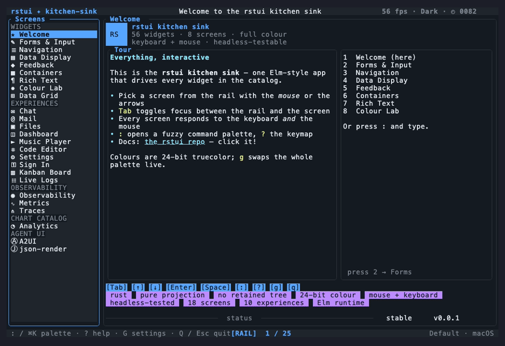

# Kitchen sink

`rstui-kitchen-sink` is one interactive full-screen app that exercises **every
widget** across its screens — a widget tour, app-experience scenes, and an
OpenTelemetry observability suite — with live keyboard + mouse, theming,
overlays and animation. It is the fastest way to *see* the whole library, and a
full-scale worked example of the [composition model](composition.md).

```sh
cargo run  -p rstui-kitchen-sink     # live, on your terminal
cargo test -p rstui-kitchen-sink     # the same app, driven headless
```



> Regenerate this and the other resolutions with `cargo xtask record
> kitchen-sink` (see [Recording](recording.md)).

## It is just an `App`

The kitchen sink follows the exact model the rest of the docs describe:

- A `KitchenSink` model owns everything — `size`, the active `screen`, the
  sidebar cursor, the focused `pane`, the open `overlay`, the animation
  `tick`, the `theme`, the toast queue, the palette query, and each screen's
  interactive state.
- `on_event` maps input to a `Msg`; `update` is the only mutation point and
  returns `Cmd::tick` to keep animation going; `view` is a pure projection.
- It runs **two ways from one reducer**: live via
  `rstui_crossterm::run_app` (alternate screen, raw mode, mouse/focus
  capture, panic-safe restore) and headless via `Harness` with scripted
  input (its CI tests). Same app, no changes — the rstui guarantee.

## The nine screens

| # | Screen | Widgets it shows |
|---|--------|------------------|
| 1 | Welcome | the global keymap + styled `Paragraph` |
| 2 | Forms | `Input`, `Editor`, `Checkbox`, `Radio`, `Switch`, `Slider`, `Button`, `Form` |
| 3 | Navigation | `List`, `Table`, `Tree`, `Menu`, `Tabs`, `Pagination`, `Stepper` |
| 4 | Data | `BarChart`, `Gauge`, `Calendar`, `Diff`, `DescriptionList`, `Accordion` |
| 5 | Feedback | `Alert`, `Badge`, `Spinner`, `Skeleton`, `Tooltip`, `Popover` |
| 6 | Containers | `Block`, `Card`, `Grid`, `SplitPane`, `Divider`, `Align`, `ScrollView`, `Scrollbar` |
| 7 | Rich Text | `Paragraph`, `Markdown`, `Mermaid` |
| 8 | Colour Lab | ANSI / 256-indexed / RGB truecolor / modifiers |
| 9 | Data Grid | `DataTable` — sort, filter, group, virtualized scroll, mouse hit-testing, in-cell editing |

The global shell (`chrome.rs`) wraps every screen: a header (brand, title,
theme + animation tick), a `Sidebar` rail, a `StatusBar` footer, and the
overlay stack (`HelpOverlay`, `CommandPalette`, `Drawer`, quit `Modal`,
`Toast` queue).

## The observability suite

A third rail section — an OpenTelemetry-style metrics / traces / logs
dashboard built from the [observability widgets](widgets/observability.md):

| Screen | Widgets it shows |
|--------|------------------|
| Observability | `StatPanel` (golden signals), `LineChart`, `Heatmap`, `LogStream` |
| Metrics | `LineChart` (p50/p95/p99), `Histogram` + percentile markers, `Heatmap` |
| Traces | `TraceWaterfall` ⇄ `FlameGraph` (toggle with `f`), `Table` of span attributes |

Reach them from the `Observability` rail group, the command palette
(`:observability` / `:metrics` / `:traces`), or the sidebar. They are
arrow-driven; the series animate from the shared animation `tick`.

Having no number hotkey, they are out of reach of the digit-bound
`render_e2e` suite, so they carry their own app-scale coverage:
`crates/rstui-kitchen-sink/tests/data_viz_e2e.rs` (headless `Harness` —
palette-navigates to each, asserts the widget content renders, coloured,
total under resize/ticks) plus the `vhs/e2e/kitchen-sink-dataviz.{tape,expect}`
real-binary gate run by `cargo xtask record e2e --check`.

## The chart catalog

A fourth rail section — the exploratory (non-dashboard) chart types from the
[charts widgets](widgets/charts.md), in one selectable `2×3` grid:

| Screen | Widgets it shows |
|--------|------------------|
| Analytics | `ScatterPlot`, `RadarChart`, `BoxPlot`, `Candlestick`, `Treemap`, `Sankey` |

Reach it from the `Chart catalog` rail group, the command palette
(`:analytics`), or the sidebar. `←/→/↑/↓` move the highlight, `Enter` names
the focused chart; the scatter and candlestick series animate from the
shared `tick`. Like the observability suite it has no number hotkey, so it
carries its app-scale coverage in the same `data_viz_e2e.rs` suite. The
business-dashboard chart widgets themselves live on the `Dashboard`
experience screen.

## Keybindings

| Key(s) | Action |
|--------|--------|
| `1`–`9` | Jump straight to a screen |
| `Tab` | Toggle focus between the sidebar and the content pane |
| `↑ ↓ ← →` | Navigate (sidebar selection or per-widget) |
| `Enter` / `Space` | Activate / toggle / confirm |
| `f` | Traces screen: toggle the span waterfall ⇄ flame graph |
| `s` `o` `c` `/` `e` | Data Grid: sort · group · collapse · filter · edit cell (`[` `]` pick the active column) |
| `:` | Command palette — type to filter, `Enter` to jump |
| `?` | Help overlay — the **live** keymap (reverse-looked-up, follows remaps) |
| `g`, or `?`→`k` | Settings drawer — the keymap manager, the shared [`KeymapView`](widgets/overlays-and-control.md#keymapview) widget (capture-to-rebind, disable, theme). `?`→`k` is the universal gateway, the same two keystrokes in every rstui app |
| `F2` | Cycle keymap: Default → Vim → opencode-style Leader |
| `q` / `Esc` | Quit (opens a confirm modal; `y`/`Enter` confirms) |
| typing | Into focused inputs; filters the palette |
| mouse / scroll | Click hit-testing; wheel/PageUp-Down scrolling; **drag-and-drop** on the Kanban board (press a card, drag it to another column — see the reusable pointer-gesture recipe in [composition.md](composition.md#mouse-clicks-drags-and-reusable-pointer-gestures)) |

Every shell binding is a semantic `Action` resolved through the shared
[`rstui-keymap`](keymaps.md) engine (ADR 0015), and the drawer's keymap
manager is the shared
[`KeymapView`](widgets/overlays-and-control.md#keymapview) widget — the
exact same widget git-review and acp-client use, a pure projection of the
live keymap. So the bindings above are the *Default* keymap; switching
keymaps or remapping in the drawer changes them and the help/footer follow
automatically. The displayed chords are
per-OS (`⌘` on macOS, `Ctrl` elsewhere). `RSTUI_KEYMAP=Vim` picks a map
at launch, or point it at a keymap config file to remap actions — no
rebuild, no drawer needed, mirroring `RSTUI_THEME`
(see [Keymaps](keymaps.md#end-user-a-config-file-no-app-ui-no-rebuild)).

## Resolution adaptive

The model owns `size` (updated on `Event::Resize`) and the layout is
recomputed every frame from the current area. Every widget clips or no-ops on
oversized/tiny/zero areas — there are no panics at any size. That is why one
identical walkthrough script renders correctly at every resolution:

```sh
cargo xtask record kitchen-sink
# -> docs/media/kitchen-sink-{80x24,120x40,160x50,200x60}.gif (+ .mp4)
```

## Headless tests

`crates/rstui-kitchen-sink/tests/kitchen_sink.rs` drives the same app through
`Harness` and asserts on snapshots — it boots on Welcome with chrome rendered,
every number key lands on the right screen, the palette filters, the drawer
toggles, `q`→`y` quits, ticks + resize keep it running. The
[VHS e2e smoke](recording.md#the-end-to-end-regression-gate) complements these
by driving the *real* crossterm binary through the same kind of script.

See also: [Architecture](architecture.md) · [Component library](widgets/README.md)
· [`docs/composition.md`](composition.md).
