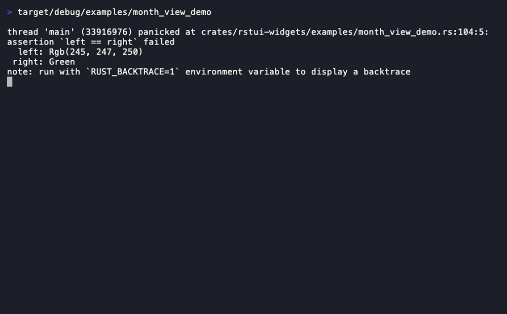
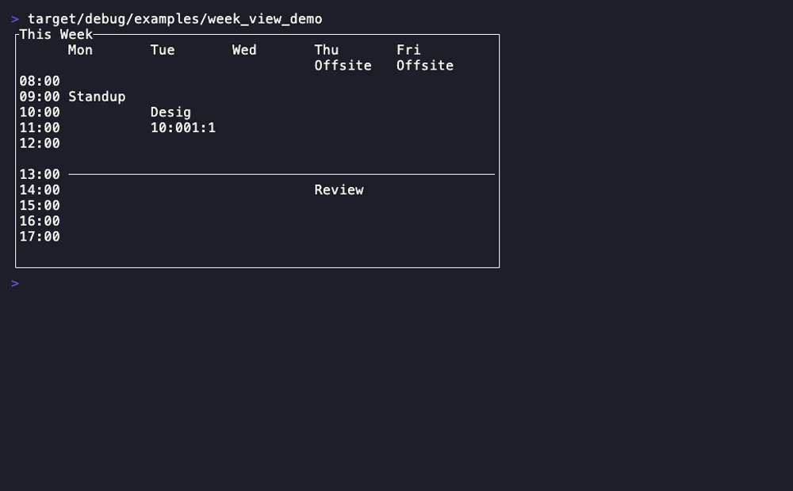
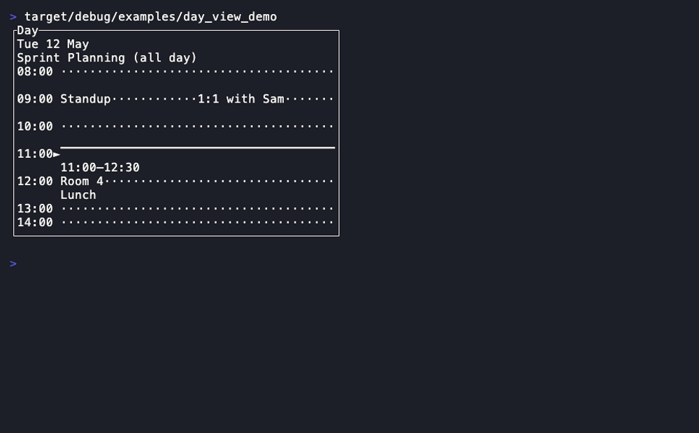
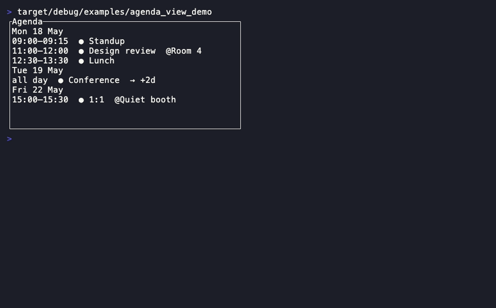
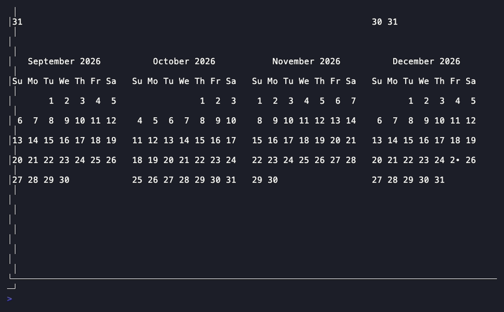
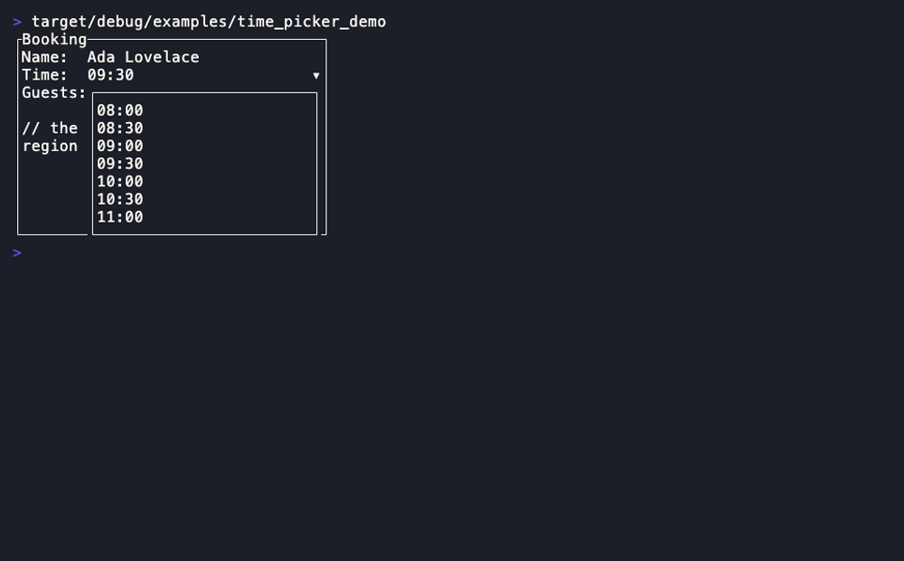
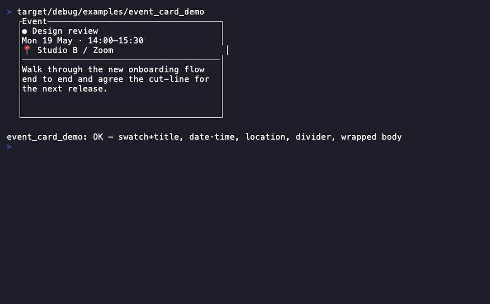
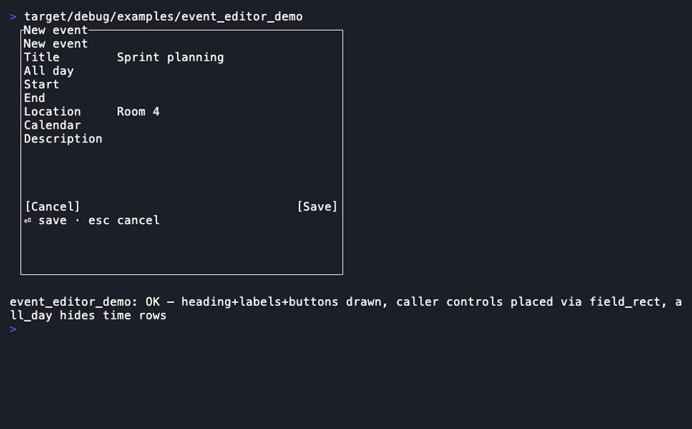
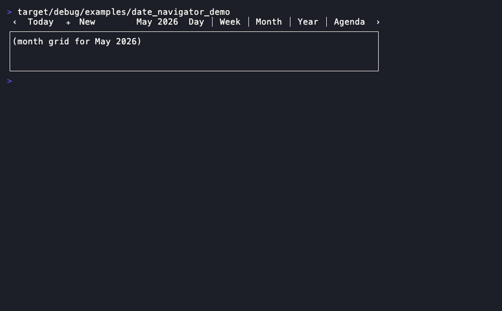

# Calendar app

Everything a scheduling TUI is built from: five event views, a time field, a
detail card, an editor dialog and a toolbar. Every one is a **pure
projection** of the same caller-owned `&[CalendarEvent]` — it implements
`rstui_core::Widget`, stamps glyphs through `Buffer::set_cell`/`set_str`, and
is total (degenerate input clips or no-ops, never panics). None does **any
date math**: dates are caller-owned integers (an opaque day axis + a
minute-of-day), the [`Calendar`](forms-and-data.md#calendar)/[`Gantt`](charts.md#gantt)
discipline that keeps the crate dependency-free
([ADR 0002](../adr/0002-widget-crate-boundary.md) §4). The app owns
moving/scheduling via each view's `*_at` hit accessors — clicking what you see
is a pure projection, the click-as-projection rule
([ADR 0012](../adr/0012-widget-composition-and-layout-model.md),
[ADR 0026](../adr/0026-calendar-app-widget-suite.md)).
[Back to the component library](README.md).

The flagship composition is the kitchen-sink **Calendar** screen — a real
scheduling app composed from the whole family (see
[kitchen-sink.md](../kitchen-sink.md)).

## The CalendarEvent model

The shared caller-owned input every view borrows. It is a **model, not a
widget** — the [`Link`](rich-rendering.md#link) precedent: there is nothing to
render on its own, so it has no template entry. Six widgets would otherwise
each invent their own event struct; instead this module owns it once, the
views borrow it the way [`Markdown`](rich-rendering.md#markdown) borrows a
`&[Link]`, and the only behaviour here is the overlap-column packing
(`pack_day`) the time grids all need identically. It uses the `with_*`
builder + bare-getter shape (a model, not a widget config) and does **no date
math** — `day`/`end_day` are an opaque caller integer axis (days since the
caller's epoch, day-of-month, a column index — never interpreted), `start_min`/
`end_min` a minute-of-day; formatting a minute as `HH:MM` (`time_label`) is
clock arithmetic on a caller integer, not calendar math, so it pulls in no
dependency. Every input is clamped at read time so a view can never panic.

- **Companion types:** `EventLayout` (the packed column + cluster column-count
  `pack_day` returns per timed event)
- **State model:** the caller-owned event model itself — the reducer owns and
  mutates a `Vec<CalendarEvent>`; the views only borrow `&[CalendarEvent]`.

```rust
CalendarEvent::new(id: u64, title: impl Into<Cow<str>>)
.with_day(i64) .with_end_day(i64) .with_span(start: u16, end: u16)
.with_all_day(bool) .with_color(Color)
.with_location(impl Into<Cow<str>>) .with_description(impl Into<Cow<str>>)
// bare getters the views read (all clamped, total):
.id() -> u64 .title() -> &str .day() -> i64 .end_day() -> i64
.span_days() -> u32 .start_min() -> u16 .end_min() -> u16 .duration_min() -> u16
.all_day() -> bool .multi_day() -> bool .color() -> Color
.location() -> &str .description() -> &str
.covers_day(d: i64) -> bool .overlaps(other: &CalendarEvent) -> bool

// the one genuinely shared algorithm — overlap-column packing for the grids:
event::pack_day(&[&CalendarEvent]) -> Vec<EventLayout>   // { id, column, columns, start_min, end_min }
event::time_label(minute: u16) -> String                 // 24h "09:00" (clamps 24:00)
event::time_label_12h(minute: u16) -> String             // compact "9am"/"1:05pm"
event::MINUTES_PER_DAY: u16                               // 24*60, the span clamp
```

---

## MonthView



A full month grid where every day cell carries its event chips, multi-day and
all-day events stretch as continuous spanning bars, and a "+N more" footer
absorbs the overflow — the events-bearing sibling of the date-only
[`Calendar`](forms-and-data.md#calendar).

- **State model:** pure projection of caller-owned date facts (`year`,
  `month`, `day_count`, `weekday_of_first`, the same inputs
  [`Calendar`](forms-and-data.md#calendar) takes) + a borrowed
  `&[CalendarEvent]` + caller-owned `selected`/`today` day-of-month numbers
  (selection patched last). Weekday indices follow `0 = Sunday … 6 = Saturday`.

```rust
MonthView::new(year: i32, month: u32, day_count: u32, weekday_of_first: u32)
.events(&[CalendarEvent]) .first_day(i64) .first_weekday(u32)
.selected(Option<u32>) .today(Option<u32>) .max_chips(u16)
.block(Block) .style(Style) .header_style(Style) .weekday_style(Style)
.selected_style(Style) .today_style(Style) .grid_style(Style)
.day_at(area: Rect, pos: Position) -> Option<u32>
.event_at(area: Rect, pos: Position) -> Option<u64>
```

**Demo:** `cargo run -p rstui-widgets --example month_view_demo`

---

## WeekView



A multi-day time grid: an hour ruler, a day-column header row, an all-day
band, and timed events tiled side-by-side via `pack_day` with an optional
now-line — the week surface pinned next to a month grid.

- **State model:** pure projection of a borrowed `&[CalendarEvent]` across `N`
  day columns; column 0 is the caller-axis `start_day` and an event maps to
  column `event.day() - start_day`. `day_labels` is per-column header text the
  caller already formatted; `today` accents one column; `selected_event` is
  the caller-owned highlighted id. Overlap tiling delegated to
  [`event::pack_day`](#the-calendarevent-model).

```rust
WeekView::new(start_day: i64, day_count: u16)
.events(&[CalendarEvent]) .day_labels(&[&str]) .today(Option<i64>)
.hours(start_h: u16, end_h: u16) .now(Option<u16>) .selected_event(Option<u64>)
.block(Block) .style(Style) .grid_style(Style) .ruler_style(Style)
.header_style(Style) .all_day_style(Style) .now_style(Style) .selected_style(Style)
.body(area: Rect) -> Rect .all_day_band(area: Rect) -> Rect
.slot_at(area: Rect, pos: Position) -> Option<(i64, u16)>   // (day, snapped minute)
.event_at(area: Rect, pos: Position) -> Option<u64>
```

**Demo:** `cargo run -p rstui-widgets --example week_view_demo`

---

## DayView



A single-day timeline: an hour ruler, an all-day band, and one wide event
column with overlap tiling and a now-line — the focused-day, one-column
richer sibling of [WeekView](#weekview).

- **State model:** pure projection of a borrowed `&[CalendarEvent]`, drawing
  the events that [`covers_day`](#the-calendarevent-model) the caller-axis
  `day`. `day_label` is a caller-formatted header string; the visible window
  is `hours`; overlap tiling delegated to
  [`event::pack_day`](#the-calendarevent-model); `selected_event` accents one
  block (its event's `color` tints each block).

```rust
DayView::new(day: i64)
.events(&[CalendarEvent]) .day_label(impl Into<Cow<str>>)
.hours(start_h: u16, end_h: u16) .now(Option<u16>) .selected_event(Option<u64>)
.block(Block) .style(Style) .ruler_style(Style) .header_style(Style)
.all_day_style(Style) .now_style(Style) .grid_style(Style) .selected_style(Style)
.body(area: Rect) -> Rect
.minute_at(area: Rect, pos: Position) -> Option<u16>
.event_at(area: Rect, pos: Position) -> Option<u64>
```

**Demo:** `cargo run -p rstui-widgets --example day_view_demo`

---

## AgendaView



A chronological, day-grouped event list — the "schedule" / list calendar
view — the [`List`](core-set.md#list) scroll-`offset` projection.

- **State model:** pure projection of a borrowed `&[CalendarEvent]` + a
  caller-owned scroll `offset` + an optional `selected` event id. It groups by
  `day` then `start_min`, flattens to day-header + event rows, and draws the
  window `[offset, offset + height)` exactly as [`List`](core-set.md#list)
  windows its items; `row_count` hands the reducer the total so it can clamp
  the scroll. `day_labels` is a caller-owned axis-day → header-text map (falls
  back to `"Day {n}"`). An empty slice draws a centred `empty_text`.

```rust
AgendaView::new(events: &[CalendarEvent])
.day_labels(&[(i64, &str)]) .offset(usize) .selected(Option<u64>)
.empty_text(impl Into<Cow<str>>)
.block(Block) .style(Style) .day_header_style(Style) .time_style(Style) .selected_style(Style)
.event_at(area: Rect, pos: Position) -> Option<u64>
.row_count() -> usize                 // total flattened rows, to clamp `offset`
```

**Demo:** `cargo run -p rstui-widgets --example agenda_view_demo`

---

## YearView



A twelve-month overview: twelve mini-months tiled in a grid, each rendered by
**reusing** [`Calendar`](forms-and-data.md#calendar) so its layout and
totality are inherited, not re-implemented.

- **State model:** pure projection of caller-owned per-month
  `(day_count, weekday_of_first)` pairs (the same inputs
  [`Calendar`](forms-and-data.md#calendar) takes) + optional
  `today`/`selected` `(month, dom)` + a `busy` `(month, dom)` accent set
  (caller-derived from its event model). Every mini-month *is* a
  [`Calendar`](forms-and-data.md#calendar).

```rust
YearView::new(year: i32)
.months(&[(u32, u32)]) .first_weekday(u32)
.today(Option<(u32, u32)>) .selected(Option<(u32, u32)>) .busy(&[(u32, u32)])
.block(Block) .style(Style) .header_style(Style) .title_style(Style)
.cell_rect(area: Rect, month: u32) -> Rect          // a month's mini-calendar cell
.month_at(area: Rect, pos: Position) -> Option<u32>
```

**Demo:** `cargo run -p rstui-widgets --example year_view_demo`

---

## TimePicker



A closed `HH:MM` field that drops an opaque, field-anchored list of times at a
fixed step — the time sibling of [`DatePicker`](forms-and-data.md#datepicker),
the same [`DatePicker`](forms-and-data.md#datepicker)/[`Select`](core-set.md#select)
anchored-panel idiom.

- **State model:** pure projection of caller-owned `minute`/`open`/`focused`/
  `highlight` (the keyboard row while open)/`offset` (the list scroll); no
  date math. It reuses [`List`](core-set.md#list) wholesale for the panel body
  (scrolling, highlight, totality inherited) and is opaque
  (`clear_region`d), anchored not centred — never a [`Modal`](core-set.md#modal).

```rust
TimePicker::new(minute: u16)
.open(bool) .focused(bool) .step_min(u16) .range(start_min: u16, end_min: u16)
.placeholder(impl Into<Cow<str>>) .highlight(usize) .offset(usize)
.block(Block) .style(Style) .focus_style(Style) .selected_style(Style)
.panel(area: Rect) -> Rect          // the dropped time-list panel (empty when closed)
.minute_at(area: Rect, pos: Position) -> Option<u16>
```

**Demo:** `cargo run -p rstui-widgets --example time_picker_demo`

---

## EventCard



One event's detail body — a colour-swatched title, a date·time line, an
optional location, a divider, then the wrapped description — the content a
[`Modal`](core-set.md#modal)/popover frames on "click an event".

- **State model:** pure projection of one borrowed `CalendarEvent` (like
  [`DescriptionList`](forms-and-data.md#descriptionlist) projects its rows).
  The day string is a caller-supplied `day_label` (no date math); the
  description wrap is *reused* through a private
  [`Paragraph`](core-set.md#paragraph). It does not centre or clear — pair it
  with [`Modal`](core-set.md#modal) at the call site.

```rust
EventCard::new(event: &CalendarEvent)
.day_label(impl Into<Cow<str>>)
.block(Block) .style(Style) .title_style(Style) .time_style(Style)
.location_style(Style) .divider_style(Style)
```

**Demo:** `cargo run -p rstui-widgets --example event_card_demo`

---

## EventEditor



The create/edit-event dialog as a pure **layout** projection — the
[`Form`](forms-and-data.md#form) pattern: it owns no app state, draws the
heading/labels/divider/button-bar/help, and hands each control's `Rect` back
so you render your own `Input`/`Switch`/`DatePicker`/`TimePicker`/`Select`/
text-area into them.

- **Companion types:** `EventEditorField`
  (`Title`/`AllDay`/`StartDate`/`StartTime`/`EndDate`/`EndTime`/`Location`/
  `Calendar`/`Description`/`Save`/`Cancel`)
- **State model:** pure layout — no application state. `render` and
  `field_rect` agree by construction (one shared placement pass); a hidden
  field (a time row while `all_day`) or one that does not fit collapses to
  `Rect::ZERO`. Pair it with [`Modal`](core-set.md#modal) for the centred
  opaque dialog.

```rust
EventEditor::new()                    // or ::default()
.title(impl Into<Cow<str>>) .all_day(bool) .help(impl Into<Cow<str>>)
.save_label(impl Into<Cow<str>>) .cancel_label(impl Into<Cow<str>>)
.block(Block) .style(Style) .label_style(Style) .help_style(Style)
.field_rect(field: EventEditorField, area: Rect) -> Rect   // one control rect; ZERO if hidden/unfit
```

**Demo:** `cargo run -p rstui-widgets --example event_editor_demo`

---

## DateNavigator



The calendar-app toolbar: a one-row strip with a `‹ prev` / `next ›` pair, a
centred caller-supplied period label, a `Today` and `＋ New` button, and a
segmented Day/Week/Month/Year/Agenda view-mode switch — the
[`Tabs`](core-set.md#tabs)/[`StatusBar`](core-set.md#statusbar) one-row
projection.

- **Companion types:** `NavTarget` (`Prev`/`Next`/`Today`/`New`/`Mode(usize)`)
- **State model:** pure projection — `label` is caller-formatted (no date
  math), `mode` is a caller-owned segment index the widget only reads; a
  click maps to a `NavTarget` via `target_at`. One row; an optional `Block`
  frames it.

```rust
DateNavigator::new(label: impl Into<Cow<str>>)
.mode(usize) .modes(&[&str]) .show_today(bool) .show_new(bool)
.block(Block) .style(Style) .label_style(Style) .button_style(Style) .selected_style(Style)
.target_at(area: Rect, pos: Position) -> Option<NavTarget>
```

**Demo:** `cargo run -p rstui-widgets --example date_navigator_demo`

---

Next: [Forms & data](forms-and-data.md) · [Charts & visualization](charts.md) ·
[Core set](core-set.md) · [Navigation & layout](navigation-and-layout.md)
