# Charts & visualization

The business-dashboard graph set: a free-form plotting keystone plus every
standard chart type. Each is a **pure projection** of caller-owned series —
it implements `rstui_core::Widget`, stamps glyphs through `Buffer::set_cell`,
and is total (degenerate input clips or no-ops, never panics). The
sub-cell-precision ones reuse the [`Gauge`](core-set.md#gauge) eighth-block
ramp; the free-form ones plot on [`Canvas`](#canvas).
[Back to the component library](README.md).

The flagship composition is the `dashboard` example —
`cargo run -p rstui-widgets --example dashboard` — which arranges KPI
bullets, a revenue trend, channel mix, a funnel, an ARR bridge, a roadmap
Gantt and an activity calendar in one screen.

---

## Canvas

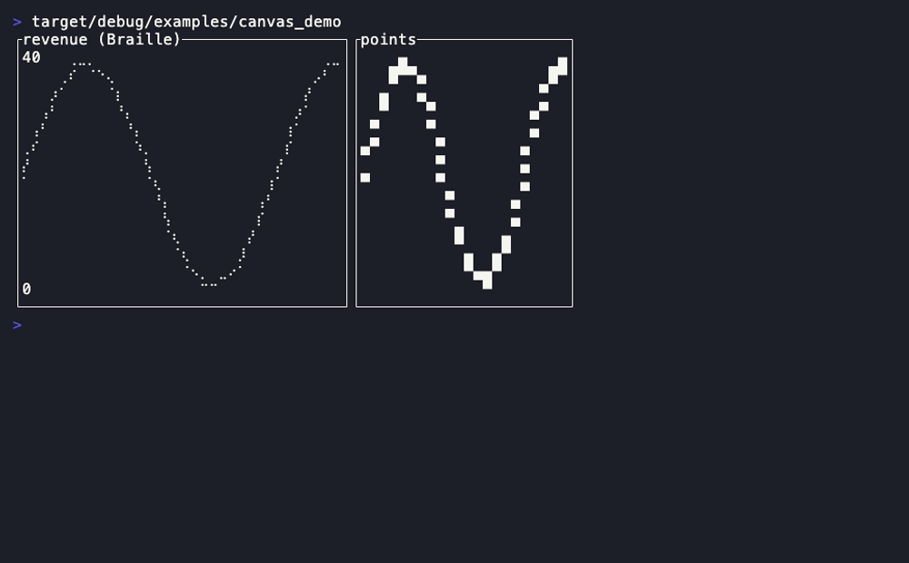

The keystone free-form Cartesian plotting surface: a `paint` closure draws
caller-owned data in data space at sub-cell `Marker` resolution.

- **Companion types:** `Marker` (`Braille`/`HalfBlock`/`Dot`/`Block`),
  `Points`, `CanvasLine`, `Rectangle`, `Shape` (the draw trait), `Context`,
  `Painter`
- **State model:** pure projection — the `paint(|ctx| …)` closure *reads*
  caller-owned data and draws it each frame (immediate mode, no retained
  scene); `Context::layer`/`print` add layers and data-space labels.

```rust
Canvas::default()
.x_bounds([f64; 2]) .y_bounds([f64; 2]) .marker(Marker)
.background(Style) .block(Block)
.paint(impl FnOnce(&mut Context))   // ctx.draw(&Points/&CanvasLine/&Rectangle), ctx.print, ctx.layer
```

**Demo:** `cargo run -p rstui-widgets --example canvas_demo`

---

## ScatterPlot

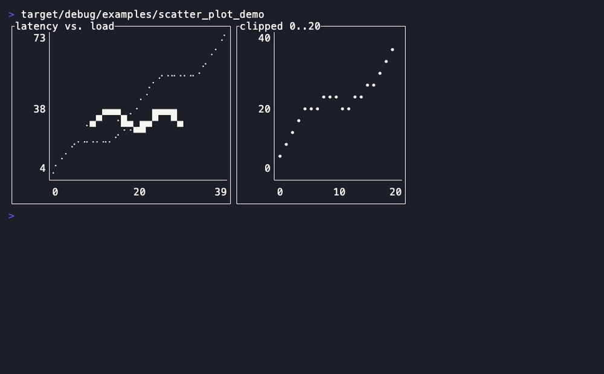

An X/Y point cloud inside framed, auto-fitting axes — the correlation panel.

- **Companion types:** `scatter_plot::Series` (kept module-qualified — too
  generic for the crate root), `Marker` (reused from [Canvas](#canvas))
- **State model:** pure projection of caller-owned `&[(f64, f64)]` point
  slices (one per `Series`); axis bounds auto-fit or are caller-set.

```rust
ScatterPlot::new(impl IntoIterator<Item = Series>)   // Series::new(&[(f64,f64)], Color).marker(Marker)
.x_bounds(Option<[f64; 2]>) .y_bounds(Option<[f64; 2]>)
.block(Block) .style(Style)
```

**Demo:** `cargo run -p rstui-widgets --example scatter_plot_demo`

---

## PieChart

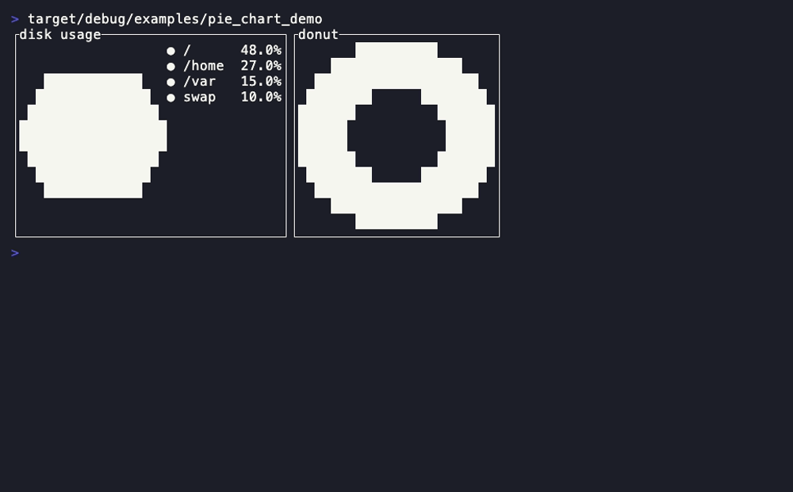

A proportional disc (or donut) of coloured wedges with an optional legend.

- **Companion types:** `Slice`
- **State model:** pure projection of caller-owned `Slice` values (each a
  `value: u64` + `Color` + label); proportions are the widget's to compute.

```rust
PieChart::new(impl IntoIterator<Item = Slice>)        // Slice::new(u64, Color, impl Into<Line>)
.donut(Option<f64>) .legend(bool) .block(Block) .style(Style)
```

**Demo:** `cargo run -p rstui-widgets --example pie_chart_demo`

---

## RadarChart

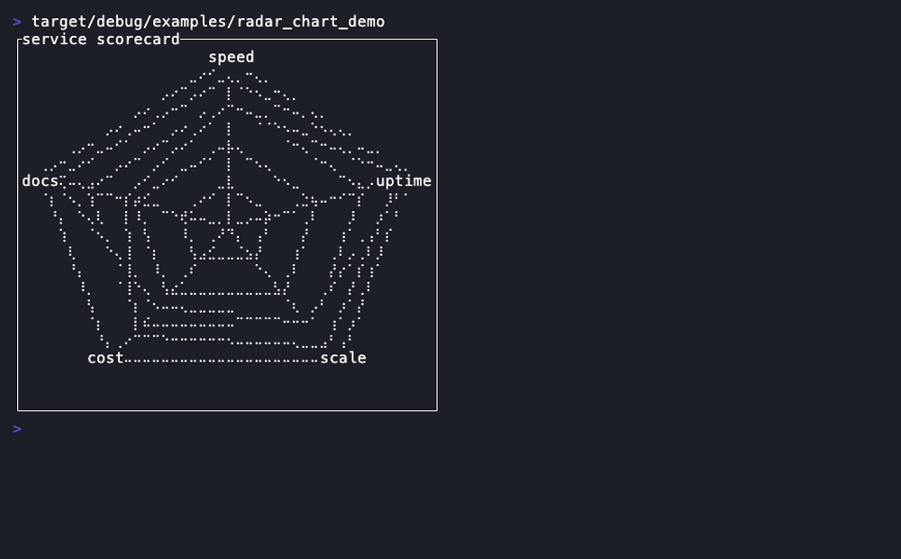

A spider/radar plot: N axes radiating from a shared centre with one or more
series polygons over concentric rings.

- **Companion types:** `RadarAxis`, `RadarSeries`
- **State model:** pure projection of caller-owned per-axis `&[f64]` series
  (`RadarSeries`) against caller-owned axis maxima (`RadarAxis`).

```rust
RadarChart::new(&[RadarAxis], &[RadarSeries])         // RadarAxis::new(max,label); RadarSeries::new(&[f64],Color)
.rings(u16) .block(Block) .style(Style) .grid_style(Style)
```

**Demo:** `cargo run -p rstui-widgets --example radar_chart_demo`

---

## BoxPlot

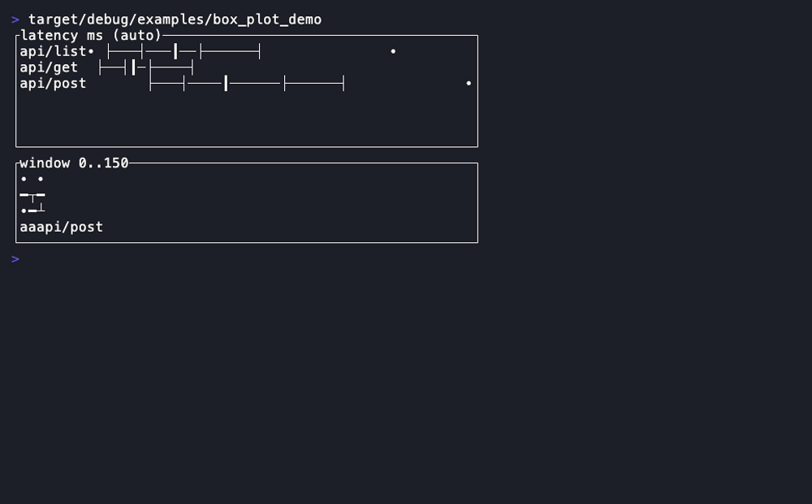

A box-and-whisker plot over a shared value scale — the distribution panel.

- **Companion types:** `BoxStats`, `BoxPlotOrientation` (`Horizontal`/`Vertical`)
- **State model:** pure projection of caller-owned five-number summaries
  (`BoxStats`: min/q1/median/q3/max + outliers); no statistics computed.

```rust
BoxPlot::new(impl IntoIterator<Item = BoxStats>)      // BoxStats::new(label,min,q1,median,q3,max).outliers(Vec<f64>)
.bounds(Option<[f64; 2]>) .orientation(BoxPlotOrientation) .block(Block)
.style(Style) .box_style(Style) .whisker_style(Style) .median_style(Style) .outlier_style(Style)
```

**Demo:** `cargo run -p rstui-widgets --example box_plot_demo`

---

## ViolinChart

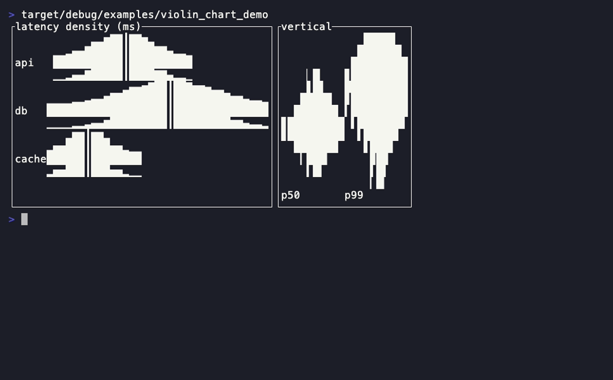

A violin (density) plot over a shared value scale — the distribution-*shape*
sibling of [BoxPlot](#boxplot), which shows only the five-number summary.

- **Companion types:** `Violin`, `ViolinOrientation` (`Horizontal`/`Vertical`)
- **State model:** pure projection of a caller-computed density profile per
  `Violin` (`Vec<f64>` sampled across the window, like `BoxPlot` takes the
  precomputed quartiles — no statistics in the dependency-free widget) plus an
  optional median; symmetric body at eighth-block sub-cell thickness.

```rust
ViolinChart::new(impl IntoIterator<Item = Violin>)   // Violin::new(label, Vec<f64>).median(f64)
.bounds(Option<[f64; 2]>) .orientation(ViolinOrientation) .block(Block)
.style(Style) .violin_style(Style) .median_style(Style) .label_style(Style)
```

**Demo:** `cargo run -p rstui-widgets --example violin_chart_demo`

---

## Candlestick

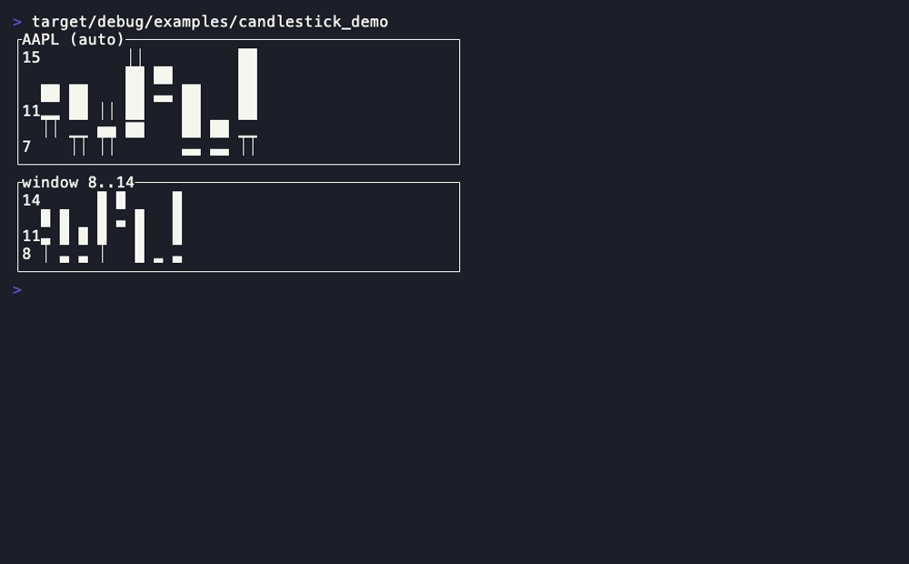

An OHLC financial chart with eighth-block sub-cell bodies and a price axis.

- **Companion types:** `Candle`
- **State model:** pure projection of a caller-owned `&[Candle]`
  (open/high/low/close `f64`); bullish/bearish colouring is derived.

```rust
Candlestick::new(impl IntoIterator<Item = Candle>)    // Candle::new(open,high,low,close)
.bounds(Option<[f64; 2]>) .candle_width(u16) .gap(u16) .block(Block)
.style(Style) .bullish_style(Style) .bearish_style(Style)
```

**Demo:** `cargo run -p rstui-widgets --example candlestick_demo`

---

## Waterfall

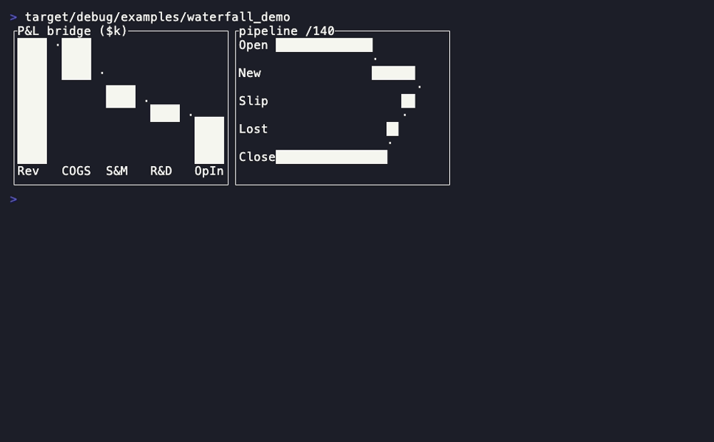

A financial bridge/variance chart: signed steps float from the running
cumulative, with absolute `Total` bars and connectors.

- **Companion types:** `WaterfallStep`, `WaterfallKind` (`Delta`/`Total`),
  `WaterfallDirection` (`Vertical`/`Horizontal`)
- **State model:** pure projection of caller-owned signed steps
  (`WaterfallStep::delta(i64,…)` / `::total(…)`); the cumulative is derived.

```rust
Waterfall::new(impl IntoIterator<Item = WaterfallStep>)
.max(Option<u64>) .direction(WaterfallDirection) .bar_gap(u16) .block(Block)
.rise_style(Style) .fall_style(Style) .total_style(Style) .connector_style(Style) .label_style(Style)
```

**Demo:** `cargo run -p rstui-widgets --example waterfall_demo`

---

## Funnel

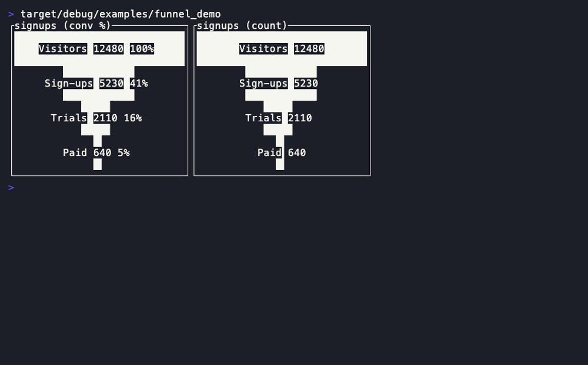

A conversion funnel: vertically stacked, horizontally centred bands sized by
each stage's value, with per-stage conversion percentages.

- **Companion types:** `FunnelStage`
- **State model:** pure projection of caller-owned stage values
  (`FunnelStage::new(u64, label)`); percentages are derived from the first.

```rust
Funnel::new(impl IntoIterator<Item = FunnelStage>)    // FunnelStage::new(u64, impl Into<Line>)
.percent(bool) .block(Block) .style(Style) .bar_style(Style) .label_style(Style)
```

**Demo:** `cargo run -p rstui-widgets --example funnel_demo`

---

## BulletChart

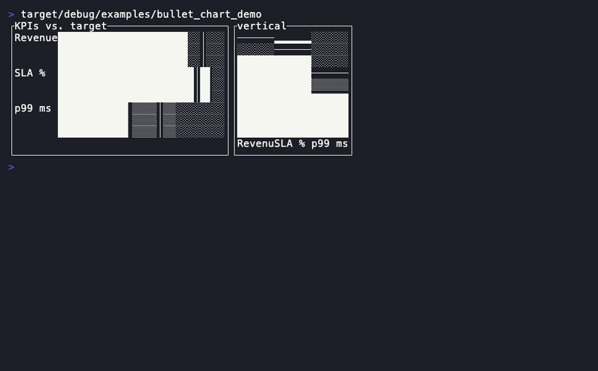

Stephen Few's bullet graph: a measure bar over qualitative range bands with a
target tick — the compact KPI strip.

- **Companion types:** `Bullet`, `BulletChartDirection` (`Horizontal`/`Vertical`)
- **State model:** pure projection of caller-owned `value`/`target`/`ranges`
  per `Bullet`; eighth-block sub-cell measure precision.

```rust
BulletChart::new(impl IntoIterator<Item = Bullet>)    // Bullet::new(value,target,Vec<ranges>,label)
.max(Option<u64>) .direction(BulletChartDirection) .block(Block)
.style(Style) .bar_style(Style) .target_style(Style) .label_style(Style)
```

**Demo:** `cargo run -p rstui-widgets --example bullet_chart_demo`

---

## Treemap

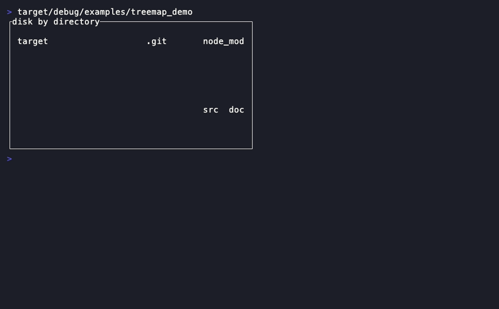

Area-proportional tiling: each category is a coloured rectangle whose area is
its share, laid out squarified.

- **Companion types:** `TreemapTile`
- **State model:** pure projection of caller-owned weighted tiles
  (`TreemapTile::new(value, Color, label)`); the layout is deterministic.

```rust
Treemap::new(impl IntoIterator<Item = TreemapTile>)   // TreemapTile::new(u64, Color, impl Into<Line>)
.padding(u16) .block(Block) .style(Style) .label_style(Style)
```

**Demo:** `cargo run -p rstui-widgets --example treemap_demo`

---

## Sankey

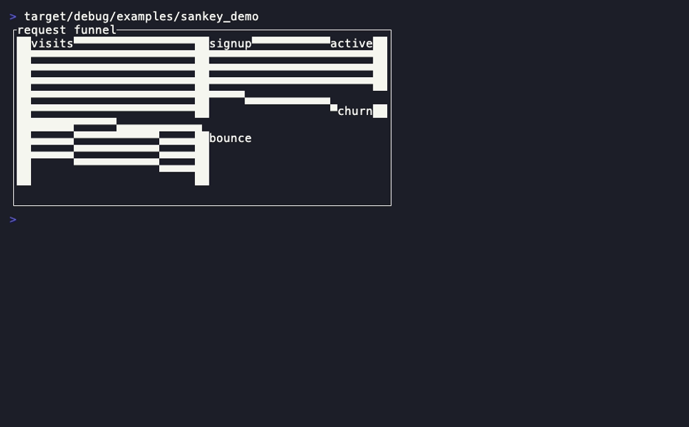

A left→right flow diagram: nodes are throughput-sized bars in columns, links
are proportional connector bands.

- **Companion types:** `SankeyNode`, `SankeyLink`
- **State model:** pure projection of caller-owned `&[SankeyNode]` +
  `&[SankeyLink]` (links index into the node slice; bad/back links are
  skipped, never a panic).

```rust
Sankey::new(&[SankeyNode], &[SankeyLink])             // SankeyNode::new(column,label); SankeyLink::new(from,to,value)
.node_width(u16) .block(Block)
.style(Style) .node_style(Style) .link_style(Style) .label_style(Style)
```

**Demo:** `cargo run -p rstui-widgets --example sankey_demo`

---

## Gantt

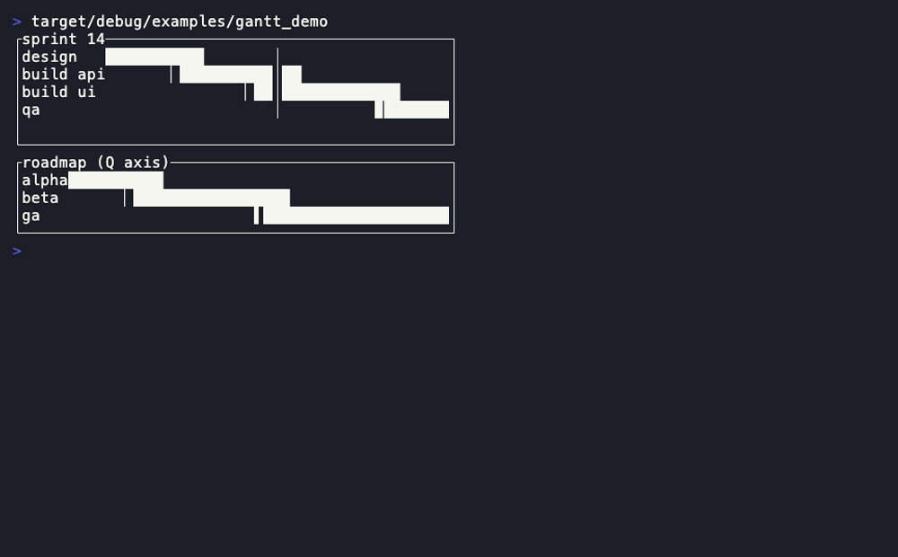

A project-timeline chart: one labelled bar per task on a shared time axis,
with a progress fill and a today marker.

- **Companion types:** `GanttTask`
- **State model:** pure projection of caller-owned task spans + progress
  (`GanttTask::new(start, end, label).progress(u16)`); no date math (caller
  supplies integer time units, the [Calendar](forms-and-data.md#calendar)
  discipline).

```rust
Gantt::new(impl IntoIterator<Item = GanttTask>)
.range(Option<(u64, u64)>) .today(Option<u64>) .block(Block)
.style(Style) .bar_style(Style) .progress_style(Style) .today_style(Style) .label_style(Style)
```

**Demo:** `cargo run -p rstui-widgets --example gantt_demo`

---

## CalendarHeatmap

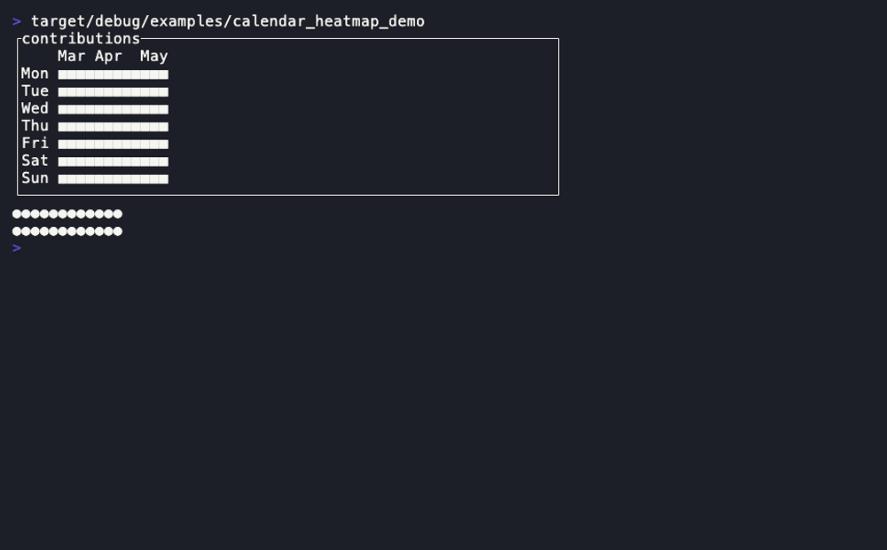

A GitHub-style contribution calendar: weeks as columns, weekdays as rows,
each day an intensity-ramped cell.

- **State model:** pure projection of a caller-owned `&[u64]` day series
  bucketed against `max`; no date math (caller supplies the start weekday and
  month labels, the [Calendar](forms-and-data.md#calendar) discipline).

```rust
CalendarHeatmap::new(&[u64])
.start_weekday(u8) .max(Option<u64>) .levels([Style; 5])
.weekday_labels(bool) .months(Vec<(usize, String)>) .cell(char) .block(Block) .style(Style)
```

**Demo:** `cargo run -p rstui-widgets --example calendar_heatmap_demo`

---

## StackedBarChart

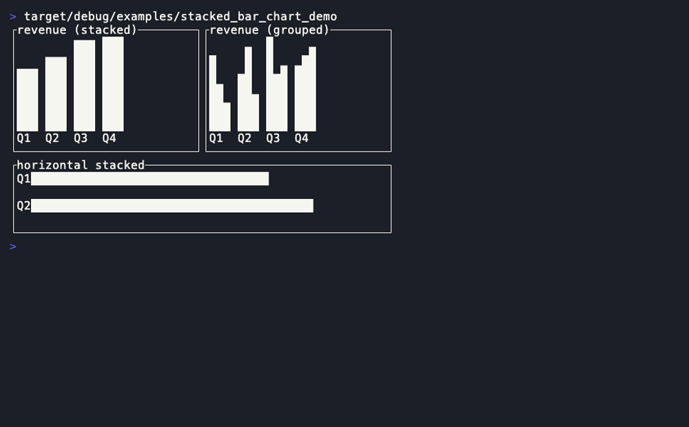

Multi-series labelled bars, **stacked** or **grouped** — the
[BarChart](forms-and-data.md#barchart) composition additive, eighth-block
sub-cell precise.

- **Companion types:** `StackedBar`, `StackMode` (`Stacked`/`Grouped`),
  `BarChartDirection` (reused from [BarChart](forms-and-data.md#barchart))
- **State model:** pure projection of caller-owned per-category segments
  (`StackedBar::new(label, Vec<(u64, Color)>)`).

```rust
StackedBarChart::new(impl IntoIterator<Item = StackedBar>)
.mode(StackMode) .direction(BarChartDirection) .max(Option<u64>)
.bar_width(u16) .bar_gap(u16) .block(Block) .style(Style) .label_style(Style)
```

**Demo:** `cargo run -p rstui-widgets --example stacked_bar_chart_demo`
