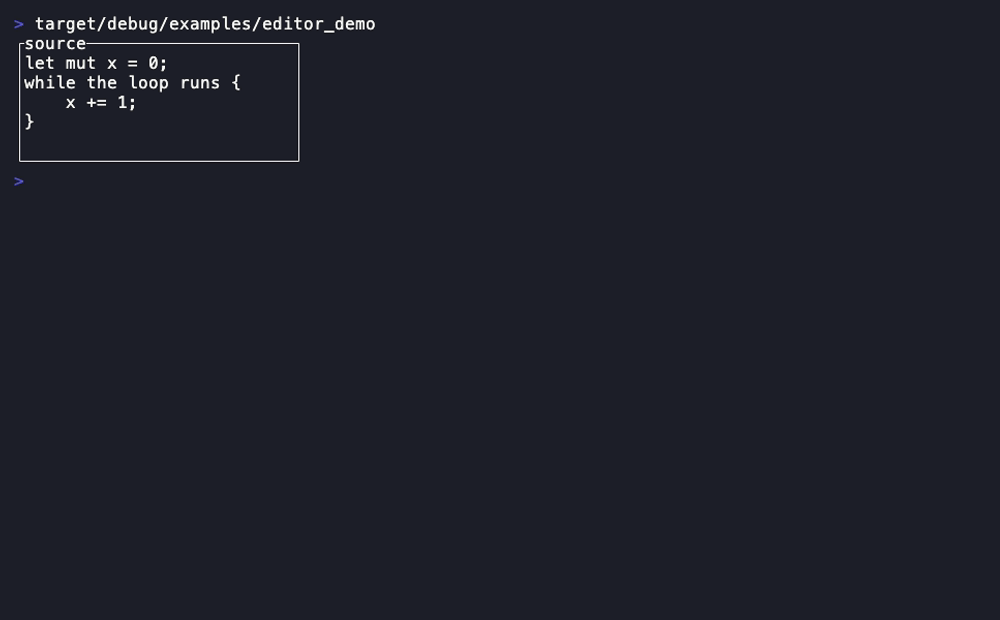
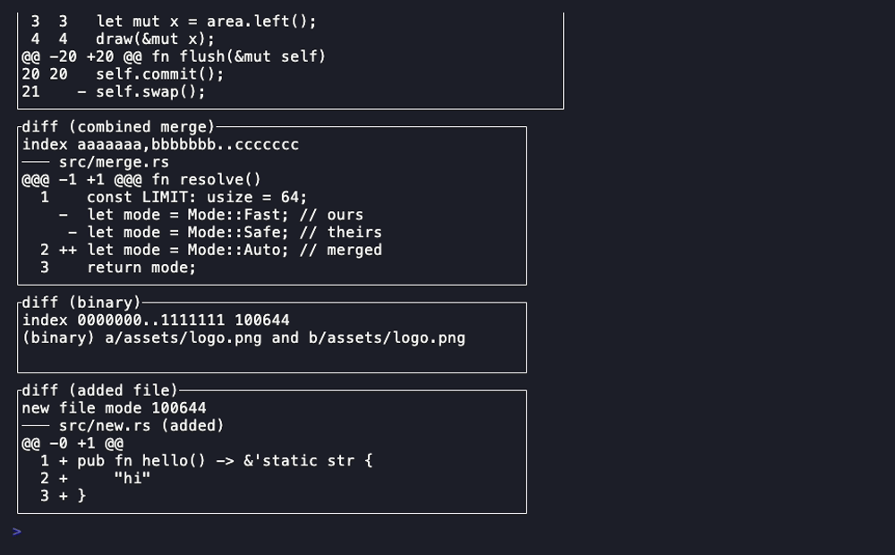
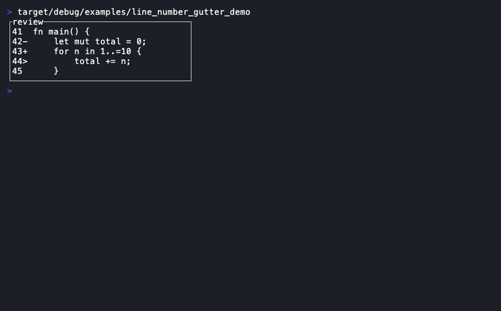

# Code

The code-editing widget set — its own crate, `rstui-code`, split out of
`rstui-widgets` so the universally-depended-on `rstui-core`/`rstui-widgets`
stay tree-sitter-free; only `rstui-code` consumers pull tree-sitter
([ADR 0024](../adr/0024-code-widget-crate-and-treesitter-exemption.md), which
supersedes [ADR 0023](../adr/0023-treesitter-tier1-excluded-leaf-crate.md) and
amends [ADR 0022](../adr/0022-syntax-colour-and-symbol-engine.md)). Every
widget here follows the exact same **pure projection** pattern as the rest of
the framework — it implements `rstui_core::Widget`, stamps glyphs through
`Buffer::set_cell`/`set_str`, and is total (degenerate input clips or no-ops,
never panics). [Back to the component library](README.md).

- Every widget has a runnable demo: `cargo run -p rstui-code --example <name>`.
- Every widget has a recorded GIF under [`media/`](media/) (regenerate with
  `cargo xtask record`, see [Recording](../recording.md)).

---

## Editor



A multi-line text-entry panel with a rendered 2-D caret and caller-owned 2-D
scroll — `Input`'s multi-line sibling.

- **Companion types:** `Extmark`
- **State model:** pure projection of a borrowed caller-owned [`TextArea`](../core-reference.md#textarea) + 2-D scroll + `focused`.

```rust
Editor::new(area: &TextArea)
.scroll(impl Into<Position>) .focused(bool)
.placeholder(impl Into<Cow<str>>) .cursor_style(Style) .extmarks(&[Extmark])
```

Crate: `rstui-code` (ADR 0024) — `use rstui_code::…`

**Demo:** `cargo run -p rstui-code --example editor_demo`

---

## Diff



A unified-diff parser with a line-number gutter, a three-colour scheme and
intra-line word highlighting. Unified or split (side-by-side) layout.

- **Companion types:** `DiffLayout` (`Unified`/`Split`), `DiffTheme`
- **State model:** pure projection of caller-owned diff source text.

```rust
Diff::new(src: &str)
.layout(DiffLayout) .side_by_side() .syntax(bool) .theme(DiffTheme)
```

Crate: `rstui-code` (ADR 0024) — `use rstui_code::…`

**Demo:** `cargo run -p rstui-code --example diff_demo`

---

## LineNumberGutter



A right-aligned numeric gutter with an optional per-row sign column and an
inner accessor — the gutter `Editor`/`Diff`-style views render beside.

- **State model:** pure layout projection of caller-owned line-number metadata.

```rust
LineNumberGutter::new(first: u64, rows: usize)
.signs(&[char]) .row_styles(&[Style])
.inner(area: Rect) -> Rect          // the text rect beside the gutter
```

Crate: `rstui-code` (ADR 0024) — `use rstui_code::…`

**Demo:** `cargo run -p rstui-code --example line_number_gutter_demo`

---

Next: [Core set](core-set.md) · [Rich rendering](rich-rendering.md) ·
[Forms & data](forms-and-data.md) ·
[Navigation & layout](navigation-and-layout.md) ·
[Overlays & control](overlays-and-control.md)
