# Core set

The foundational widgets. Containers, text, the 1-D/2-D selection family, the
form controls, the overlay primitives. [Back to the component library](README.md).

---

## Block

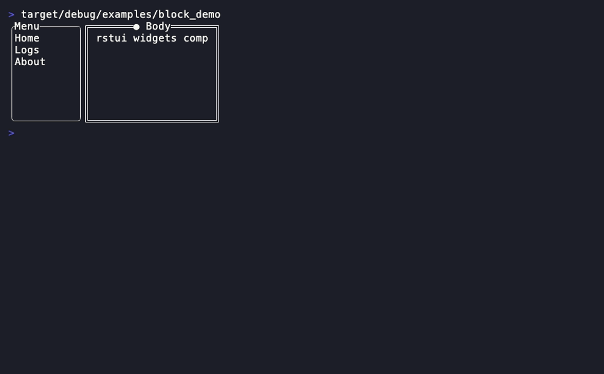

The foundational container: optional borders (any side, any of four styles), a
styled fill, padding, and a clipped titled `Line`. Almost every other widget
takes an optional `Block`.

- **Companion types:** `Borders` (bitset), `BorderType` (`Plain`/`Rounded`/`Double`/`Thick`), `BorderSet`, `Padding`
- **State model:** owns nothing — pure decoration configured by the caller.

```rust
Block::new() / Block::bordered()
.borders(Borders) .border_type(BorderType) .border_style(Style)
.title(impl Into<Line>) .style(Style) .padding(Padding)
.inner(area: Rect) -> Rect          // the content rect inside borders+padding
```

`block.inner(area)` is the canonical nesting move: frame with the block, then
render content into the returned inner `Rect`.

**Demo:** `cargo run -p rstui-widgets --example block_demo`

---

## Paragraph

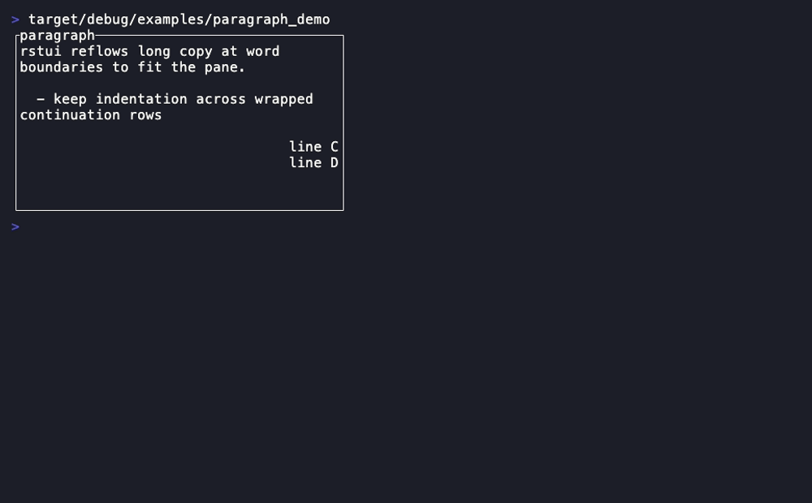

Multi-line text with soft word-wrap, scroll, alignment and an optional framing
`Block`. The general-purpose text body.

- **Companion types:** `Wrap { trim: bool }`
- **State model:** pure projection of caller-owned `Text` + scroll offset.

```rust
Paragraph::new(impl Into<Text>)
.block(Block) .wrap(Wrap) .scroll(impl Into<Position>) .alignment(Alignment)
.line_count(width: u16) -> usize     // wrapped line count, for scroll math
```

**Demo:** `cargo run -p rstui-widgets --example paragraph_demo`

---

## List

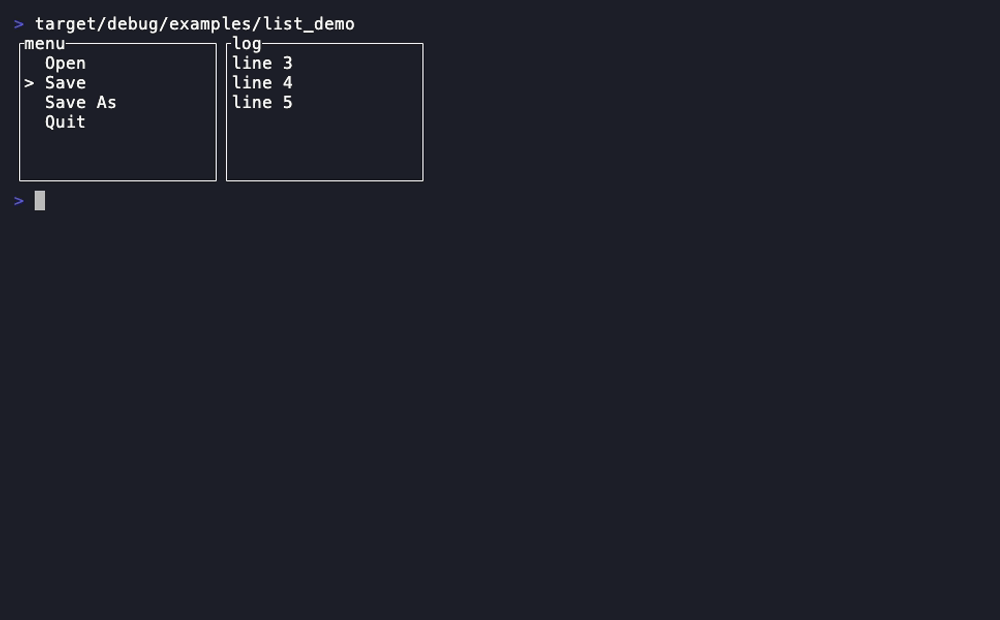

A vertical scrollable single-select column with a highlight bar/gutter. The
1-D selection primitive `Menu`, `Select` and `Sidebar` reuse.

- **Companion types:** `ListItem`
- **State model:** pure projection of caller-owned `selected: Option<usize>` and `offset: usize`.

```rust
List::new(items: impl IntoIterator)
.highlight_symbol(impl Into<Cow<str>>) .highlight_style(Style)
.selected(Option<usize>) .offset(usize)
.row_at(area: Rect, pos: Position) -> Option<usize>  // click/drag hit seam (border+offset aware)
```

**Demo:** `cargo run -p rstui-widgets --example list_demo`

---

## Tabs

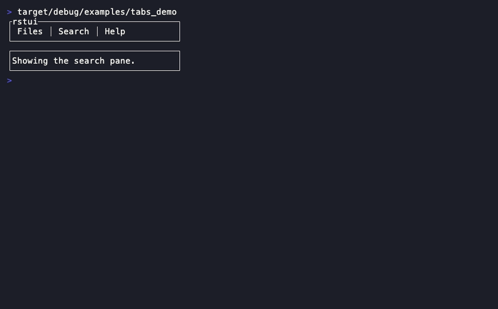

A one-row horizontal title strip with one selected — `List`'s pure-projection
model on the other axis.

- **State model:** pure projection of caller-owned `selected: Option<usize>`.

```rust
Tabs::new(titles: impl IntoIterator)
.selected(Option<usize>) .highlight_style(Style) .divider(impl Into<Span>)
.tab_at(area: Rect, pos: Position) -> Option<usize>  // variable-width hit seam (not an even split)
```

**Demo:** `cargo run -p rstui-widgets --example tabs_demo`

---

## Gauge

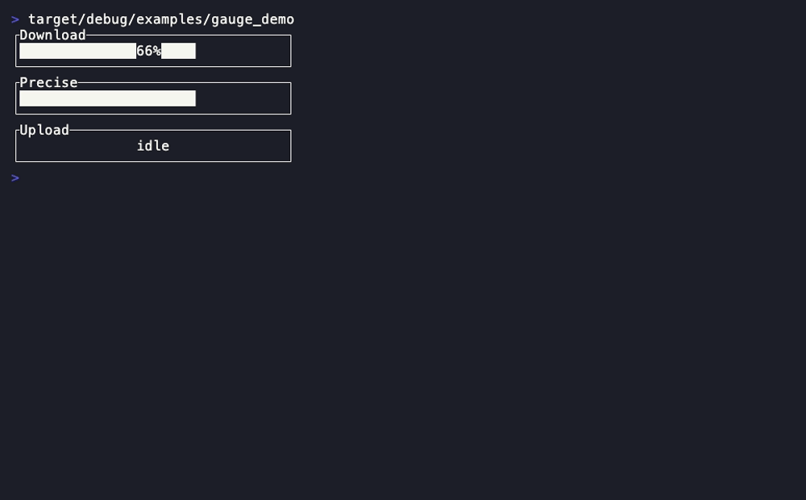

A horizontal progress bar — the first widget to render at **sub-cell
precision** (fractional eighth-block glyphs).

- **State model:** pure projection of caller-owned `ratio: f64` (clamped `0.0..=1.0`).

```rust
Gauge::default()
.ratio(f64) .label(impl Into<Span>) .gauge_style(Style)
```

**Demo:** `cargo run -p rstui-widgets --example gauge_demo`

---

## Scrollbar

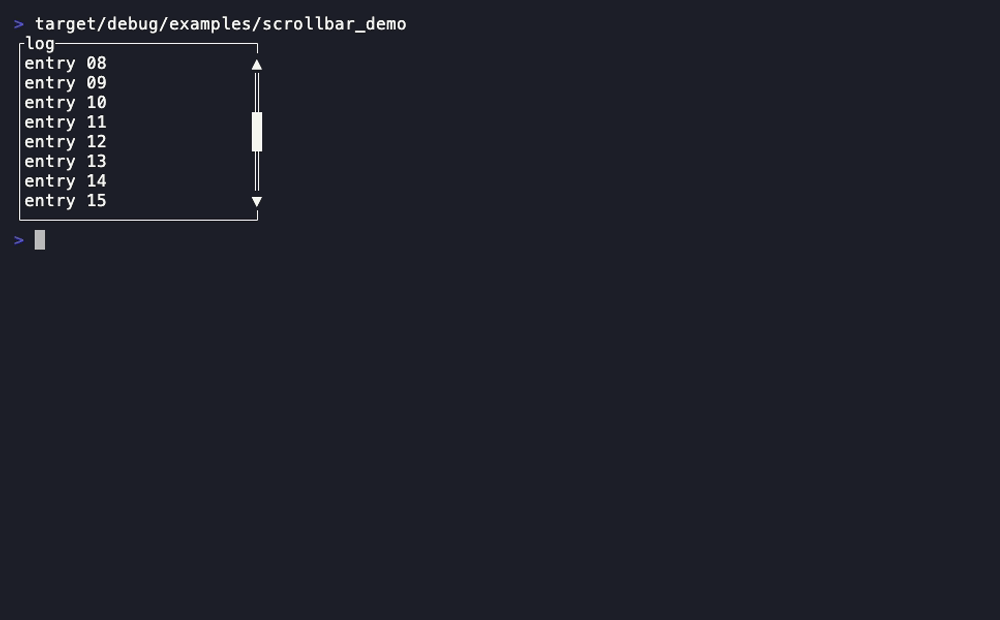

A track-and-thumb scroll indicator along one edge; the visible companion to
`List`/`Paragraph` scrolling. No lifetime — every part is a single `char`.

- **Companion types:** `ScrollbarOrientation` (`VerticalRight`/`VerticalLeft`/`HorizontalBottom`/`HorizontalTop`)
- **State model:** pure projection of caller-owned content/viewport lengths + position (pairs with [`ScrollState`](../core-reference.md#scroll)).

```rust
Scrollbar::default()
.content_length(usize) .viewport_length(usize) .position(usize)
.orientation(ScrollbarOrientation)
// draggable-thumb mouse seam (pure; the reducer owns the scroll position):
.thumb_rect(area: Rect) -> Rect                 // exactly the painted thumb
.position_at(area: Rect, pos: Position) -> usize // clamped, total
```

The thumb is mouse-draggable in a 3-line reducer — see the widget
mouse-friendliness review in
[composition.md](../composition.md#widget-review-what-is-mouse-friendly-and-how).

**Demo:** `cargo run -p rstui-widgets --example scrollbar_demo`

---

## Spinner

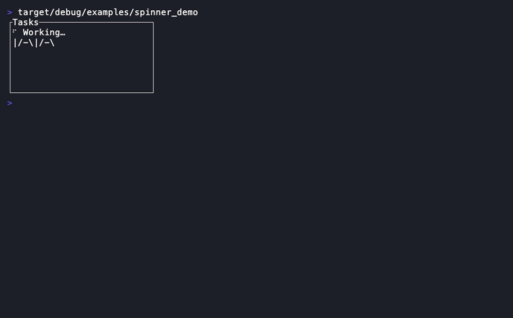

A one-cell animated busy indicator and the first consumer of the
`Frame::count()` animation clock.

- **State model:** pure projection of a caller-owned `tick: usize` (frame index — *not* a wall clock).

```rust
Spinner::default()
.tick(usize) .frames(&[char])
.glyph() -> Option<char>
```

**Demo:** `cargo run -p rstui-widgets --example spinner_demo`

---

## FpsCounter


A live render-rate readout — one line to make any app's frame performance
visible. A pure projection of a caller-owned `FpsMeter`; the widget samples
the borrowed meter as it renders, so a drop-in `FpsCounter::new(&self.fps)`
per frame is the whole feature.

- **State model:** pure projection of a caller-owned `FpsMeter` (the §P1
  interior-mutable caller-owned-state pattern, like `ScrollState`).
- **Deterministic under test:** sub-4ms gaps (the synchronous `Harness`
  loop) report a stable `--- fps` placeholder, never a nondeterministic
  number — so the demo doubles as a snapshot test, and live shows the real
  rate.

```rust
FpsMeter::new()              // own one on your model
FpsCounter::new(&meter)
.style(Style) .prefix(&str)
// meter.fps() -> Option<f32> ; meter.label() -> String
```

**Demo:** `cargo run -p rstui-widgets --example fps_counter_demo`

---

## Table

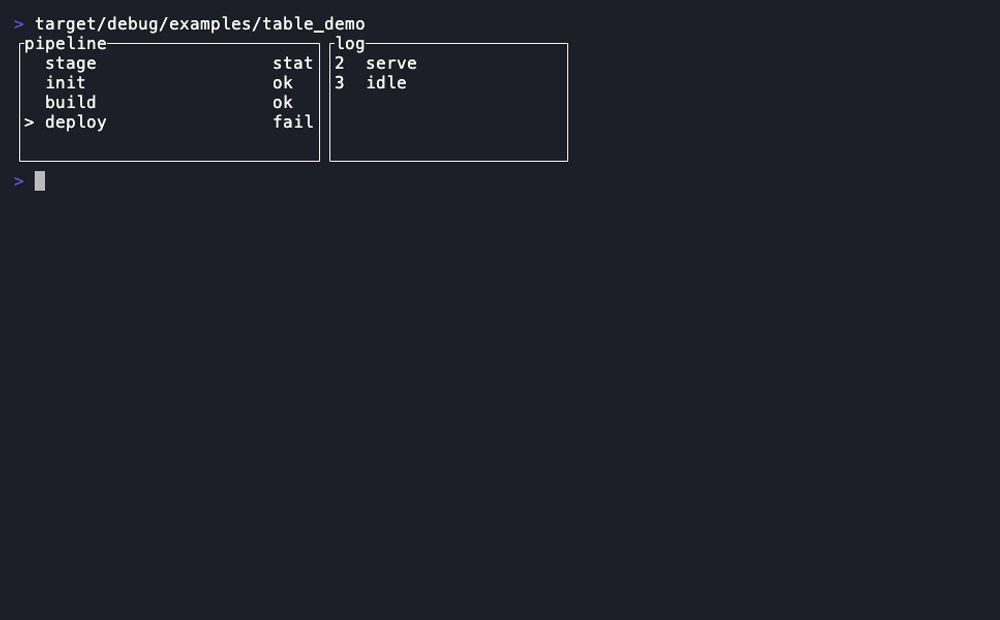

A column-aligned grid with an optional fixed header and single-row selection —
the 2-D generalization of `List`, reusing the `Constraint` divider for column
widths.

- **Companion types:** `Row`, `TableColumnFit` (`Manual`/`Proportional`/`Balanced`)
- **State model:** pure projection of caller-owned rows + `selected`/`offset`.

```rust
Table::new(rows, widths)
.header(Row) .selected(Option<usize>) .offset(usize)
.highlight_symbol(impl Into<Cow<str>>) .column_spacing(u16)
.wrap_cells(bool) .column_fit(TableColumnFit)
// column mouse seam (pure; faithful to render, drift-tested):
.column_rects(area: Rect) -> Vec<Rect>
.header_cell_at(area: Rect, pos: Position) -> Option<usize>  // press→drag a header to reorder
```

**Demo:** `cargo run -p rstui-widgets --example table_demo`

---

## Checkbox

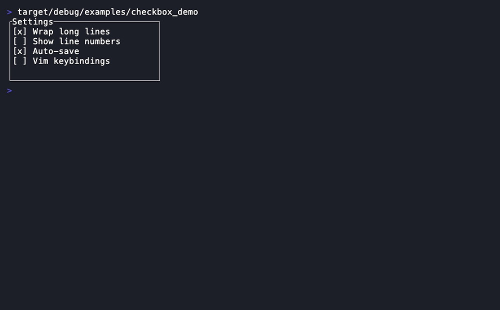

A single-line labelled boolean control — the first of the form-control family
and the first widget to model a focus visual.

- **State model:** pure projection of caller-owned `checked: bool` and `focused: bool` (focus *routing* stays in your model).

```rust
Checkbox::new(impl Into<Line>)
.checked(bool) .focused(bool)
.checked_symbol(impl Into<Cow<str>>) .unchecked_symbol(impl Into<Cow<str>>)
.focus_style(Style)
```

**Demo:** `cargo run -p rstui-widgets --example checkbox_demo`

---

## Button

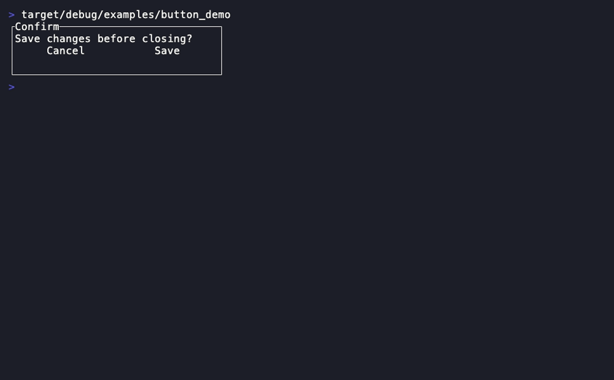

A single-line centred focusable *action* label — the first control with **no
data**: a pure projection of only a caller-owned `focused` bool. The press
action is the reducer's concern.

- **State model:** pure projection of caller-owned `focused: bool`.

```rust
Button::new(impl Into<Line>)
.focused(bool) .alignment(Alignment) .focus_style(Style)
```

**Demo:** `cargo run -p rstui-widgets --example button_demo`

---

## Radio

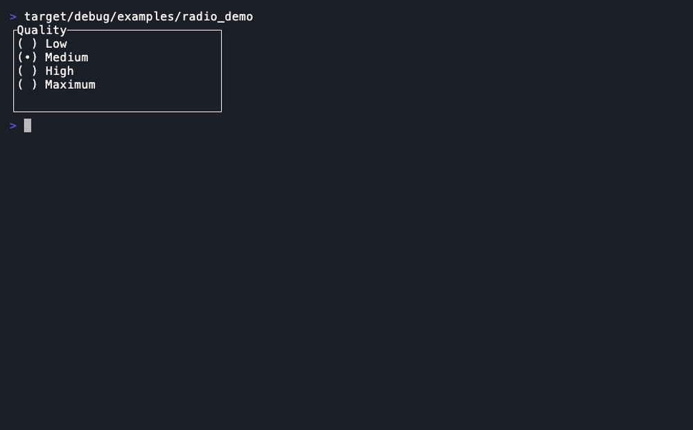

A single-line labelled *exclusive-choice* control — the exclusive-selection
sibling of `Checkbox`. Exactly-one-per-group is the caller's invariant, not
the widget's.

- **State model:** pure projection of caller-owned `selected: bool` and `focused: bool`.

```rust
Radio::new(impl Into<Line>)
.selected(bool) .focused(bool)
.selected_symbol(impl Into<Cow<str>>) .unselected_symbol(impl Into<Cow<str>>)
```

**Demo:** `cargo run -p rstui-widgets --example radio_demo`

---

## Input

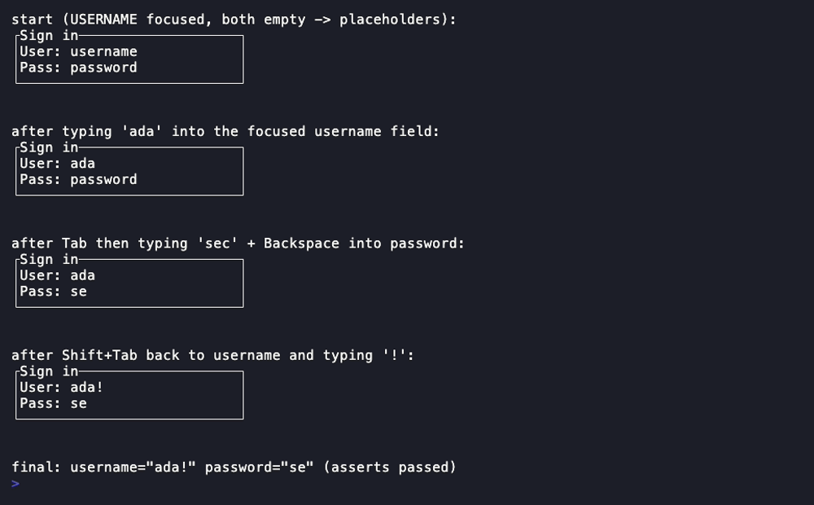

A single-line text-entry field — the first text-edit/cursor widget and the
first `focus` consumer. Renders a (non-terminal) caret and a stateless
caret-following horizontal scroll.

- **Companion types:** `Extmark` (styled char-range overlays)
- **State model:** pure projection of a borrowed caller-owned [`TextEdit`](../core-reference.md#textedit) + `focused`.

```rust
Input::new(edit: &TextEdit)
.focused(bool) .placeholder(impl Into<Cow<str>>) .cursor_style(Style)
.extmarks(&[Extmark])
```

**Demo:** `cargo run -p rstui-widgets --example input_demo`

---

## Modal

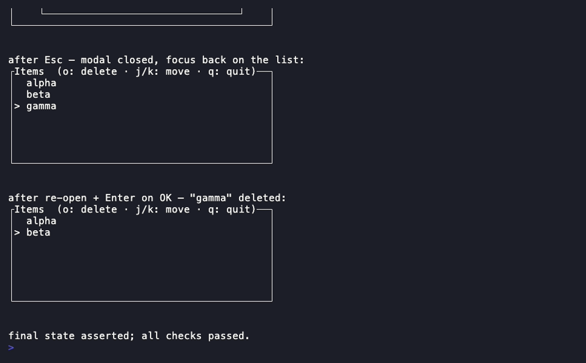

A centred opaque dialog with an optional `Block`, sized by `Constraint` — the
*visual* half of the modal-focus model (the focus half is your
[`FocusRing`](../core-reference.md#focus) scope stack). Built on
`Buffer::clear_region`.

- **State model:** pure projection; the open/closed flag and trapped focus live in your model.

```rust
Modal::new()
.width(Constraint) .height(Constraint) .block(Block) .backdrop_style(Style)
.area(overlay: Rect) -> Rect        // the modal's own rect (centred)
.inner(overlay: Rect) -> Rect       // content rect inside it
```

**Demo:** `cargo run -p rstui-widgets --example modal_demo`

---

## StatusBar

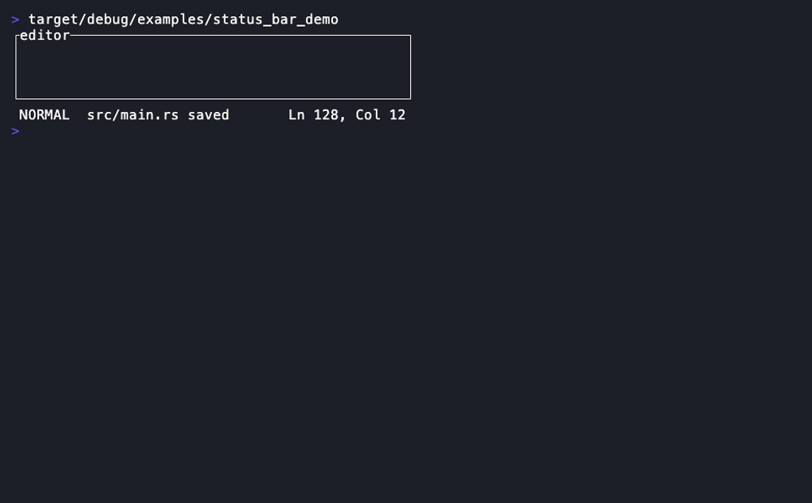

A one-row strip with left/centre/right-anchored `Line` segments — the
multi-anchor layout primitive (used by the kitchen sink footer).

- **State model:** pure projection of caller-owned segments.

```rust
StatusBar::new()
.left(impl Into<Line>) .center(impl Into<Line>) .right(impl Into<Line>)
```

**Demo:** `cargo run -p rstui-widgets --example status_bar_demo`

---

## Toast

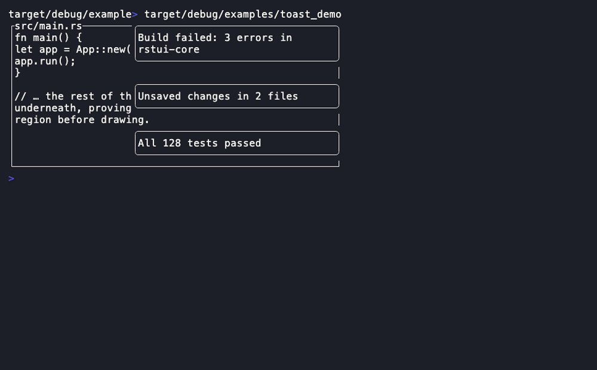

A corner-anchored opaque stack of transient notifications (newest first).
Expiry/dismissal is the reducer's job — the widget only projects the live list.

- **Companion types:** `ToastMessage`, `ToastLevel` (`Info`/`Success`/`Warning`/`Error`), `ToastCorner`
- **State model:** pure projection of a caller-owned `&[ToastMessage]`.

```rust
Toast::new()
.messages(&[ToastMessage]) .width(Constraint) .gap(u16)
.max_visible(usize) .corner(ToastCorner)
```

**Demo:** `cargo run -p rstui-widgets --example toast_demo`

---

## Tree

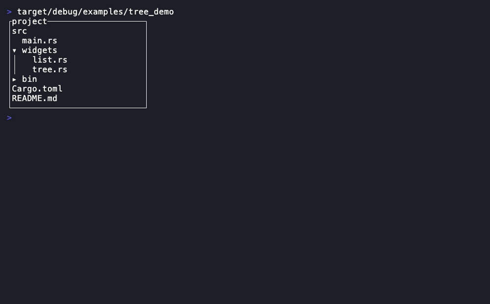

A single-select column of indented, expand/collapse rows. The caller supplies
a *flattened* list with depth + expanded flags — the tree shape and toggling
live in your model.

- **Companion types:** `TreeItem`, `TreeGuides` (`None`/`Blanks`/`Lines`)
- **State model:** pure projection of caller-owned flattened `TreeItem`s + `selected`/`offset`.

```rust
Tree::new(items: impl IntoIterator)
.selected(Option<usize>) .offset(usize) .guides(TreeGuides)
.row_at(area: Rect, pos: Position) -> Option<usize>  // flattened-visible click hit seam
```

**Demo:** `cargo run -p rstui-widgets --example tree_demo`

---

## Select

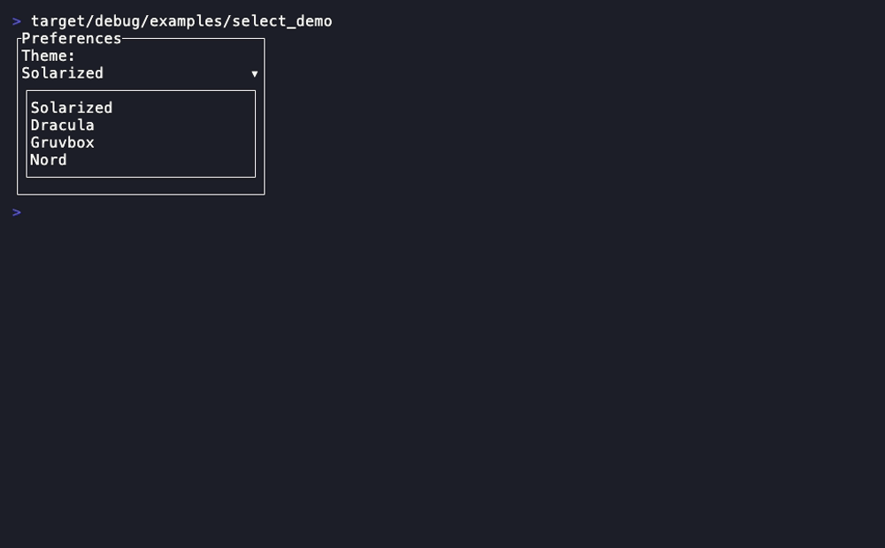

A single-line dropdown with an opaque anchored option panel (reuses `List` for
the panel). A worked composition example.

- **State model:** pure projection of caller-owned `open`/`selected`/`highlight`/`offset`.

```rust
Select::new(options: impl IntoIterator)
.open(bool) .selected(Option<usize>) .highlight(Option<usize>) .offset(usize)
.placeholder(impl Into<Cow<str>>) .block(Block)
.panel(area: Rect) -> Rect          // the dropdown panel rect
```

**Demo:** `cargo run -p rstui-widgets --example select_demo`

---

Next: [Rich rendering](rich-rendering.md) · [Forms & data](forms-and-data.md) ·
[Navigation & layout](navigation-and-layout.md) ·
[Overlays & control](overlays-and-control.md)
