# Forms & data

Form controls beyond the core set, plus the data-visualization widgets.
[Back to the component library](README.md).

---

## Slider

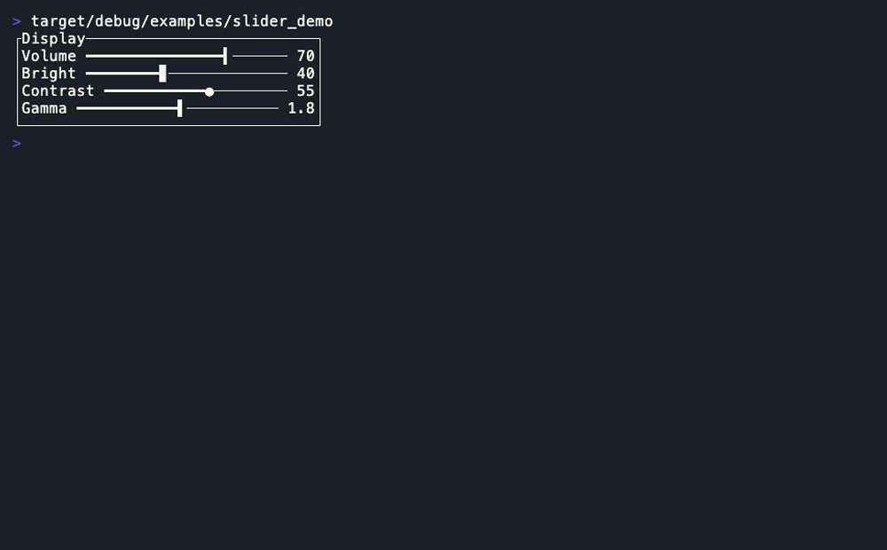

A horizontal/vertical value selector with sub-cell eighth-block precision.

- **Companion types:** `SliderOrientation` (`Horizontal`/`Vertical`)
- **State model:** pure projection of caller-owned `value: f64` (clamped to `min..=max`) + `focused`.

```rust
Slider::default()
.value(f64) .min(f64) .max(f64) .focused(bool)
.label(impl Into<Line>) .value_label(impl Into<Line>) .orientation(SliderOrientation)
.fraction() -> f64
// drag-to-set mouse seam (pure; the reducer owns `value`):
.track_rect(area: Rect) -> Rect                       // the draggable region
.value_at(area: Rect, pos: Position) -> f64           // clamped to min..=max, total
```

Click/drag-to-set is a 2-line reducer (`on Down/Drag in track_rect ⇒
value = value_at(pos)`) — see the widget mouse-friendliness review in
[composition.md](../composition.md#widget-review-what-is-mouse-friendly-and-how).

**Demo:** `cargo run -p rstui-widgets --example slider_demo`

---

## Switch

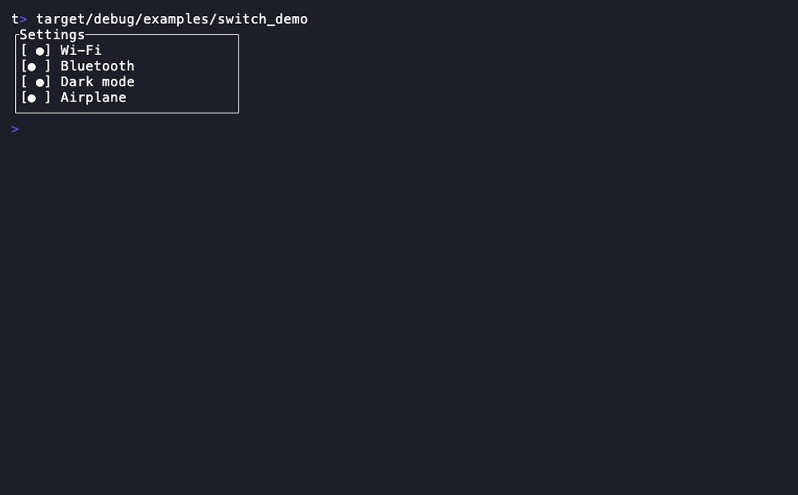

A two-state toggle with a sliding track (`[● ]` / `[ ●]`) and state labels.

- **State model:** pure projection of caller-owned `on: bool` + `focused: bool`.

```rust
Switch::default()
.on(bool) .focused(bool)
.on_label(impl Into<Line>) .off_label(impl Into<Line>)
.on_symbol(impl Into<Cow<str>>) .off_symbol(impl Into<Cow<str>>)
```

**Demo:** `cargo run -p rstui-widgets --example switch_demo`

---

## Form

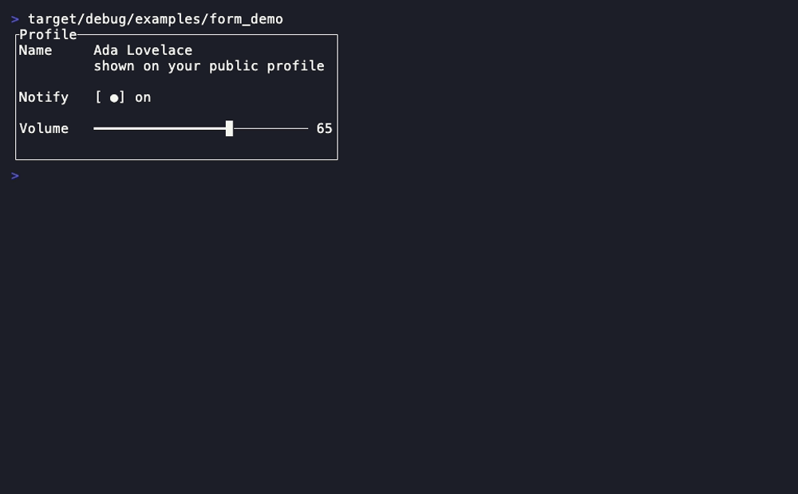

Pure layout: label + control + help rows. It renders the labels/help and hands
back the control `Rect` per field — you render the actual controls into them.

- **Companion types:** `FormField`
- **State model:** pure layout — no application state.

```rust
Form::new(fields: impl IntoIterator)
.label_width(Option<Constraint>) .row_spacing(u16)
.layout(area: Rect) -> Vec<Rect>    // one control rect per field
```

**Demo:** `cargo run -p rstui-widgets --example form_demo`

---

## MaskedInput

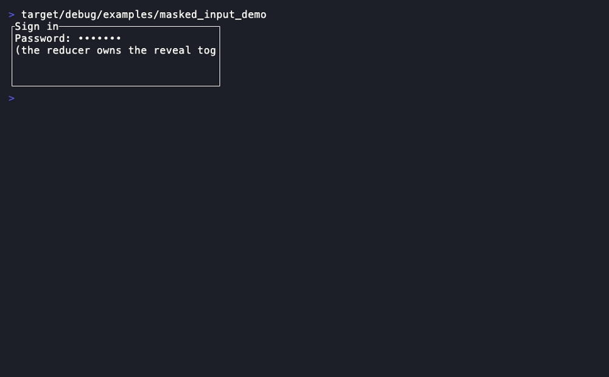

A single-line text-entry that renders a mask glyph (`•`) with a caller-owned
reveal toggle — the password sibling of [`Input`](core-set.md#input).

- **State model:** pure projection of a borrowed [`TextEdit`](../core-reference.md#textedit) + `unmasked`/`focused`.

```rust
MaskedInput::new(edit: &TextEdit)
.unmasked(bool) .mask(char) .focused(bool)
```

**Demo:** `cargo run -p rstui-widgets --example masked_input_demo`

---

## Sparkline

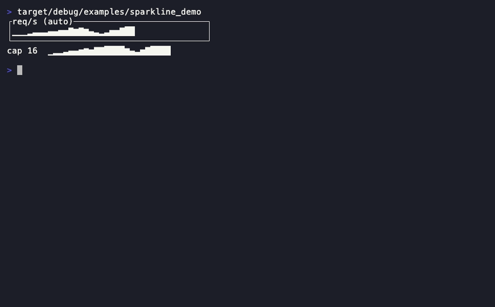

A one-row trend of a `u64` series via eight vertical block glyphs.

- **State model:** pure projection; borrows a caller-owned `&[u64]`.

```rust
Sparkline::new(data: &[u64])
.max(Option<u64>)
```

**Demo:** `cargo run -p rstui-widgets --example sparkline_demo`

---

## BarChart

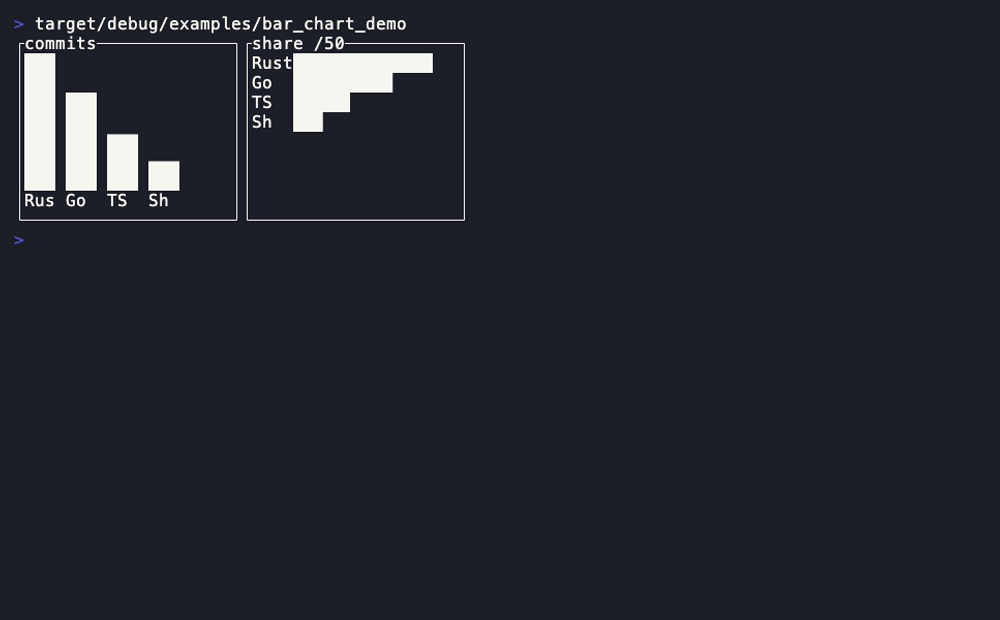

Labelled value bars (vertical or horizontal) with sub-cell precision.

- **Companion types:** `Bar`, `BarChartDirection` (`Vertical`/`Horizontal`)
- **State model:** pure projection of a caller-owned bar list.

```rust
BarChart::new(bars: impl IntoIterator)
.max(Option<u64>) .direction(BarChartDirection) .bar_gap(u16) .bar_width(u16)
```

**Demo:** `cargo run -p rstui-widgets --example bar_chart_demo`

---

## Calendar

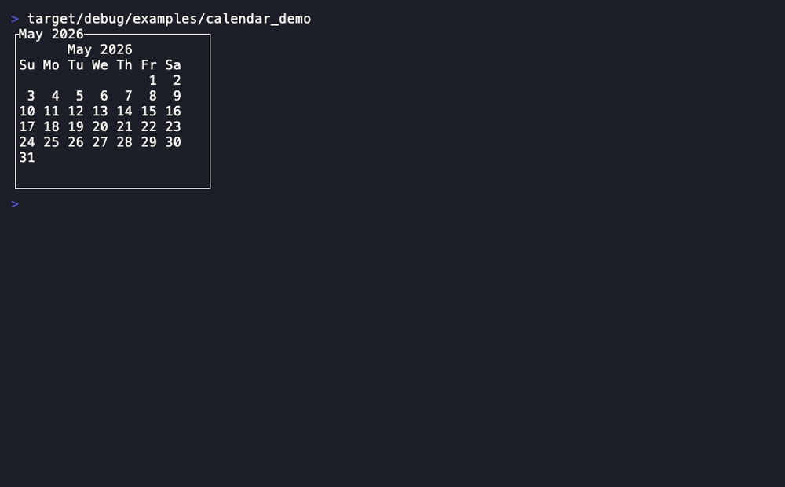

A month day-grid. It does **no date math** — the caller supplies the day count
and the weekday of the first — so the widget stays dependency-free and total.

- **State model:** pure projection of caller-owned calendar facts + selection.

```rust
Calendar::new(year: i32, month: u32, day_count: u32, first_weekday: u32)
.selected(Option<u32>) .today(Option<u32>) .first_weekday(u32)
```

**Demo:** `cargo run -p rstui-widgets --example calendar_demo`

---

## DatePicker

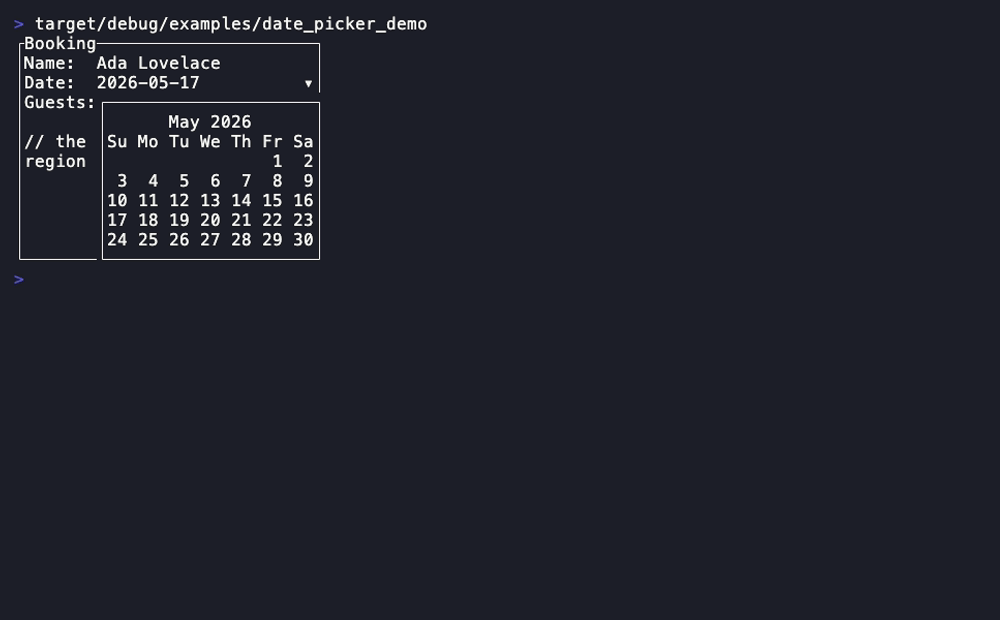

A closed date field that drops an opaque `Calendar` panel (the `Calendar` +
`Select` idiom).

- **State model:** pure projection of caller-owned date facts + `open`/`selected`.

```rust
DatePicker::new(year: i32, month: u32, day_count: u32, first_weekday: u32)
.open(bool) .selected(Option<u32>) .today(Option<u32>)
.panel(area: Rect) -> Rect          // the dropped calendar panel rect
```

**Demo:** `cargo run -p rstui-widgets --example date_picker_demo`

---

## DescriptionList

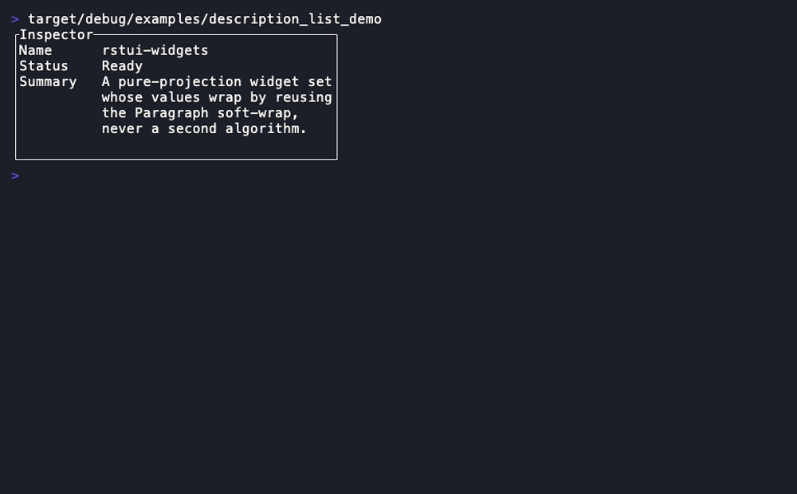

An aligned two-column key→value inspector; values wrap via `Paragraph`.

- **Companion types:** `DescriptionRow`
- **State model:** pure projection of a caller-owned `&[DescriptionRow]`.

```rust
DescriptionList::new(rows: impl IntoIterator)
.key_width(Option<Constraint>) .column_spacing(u16)
```

**Demo:** `cargo run -p rstui-widgets --example description_list_demo`

---

## Badge

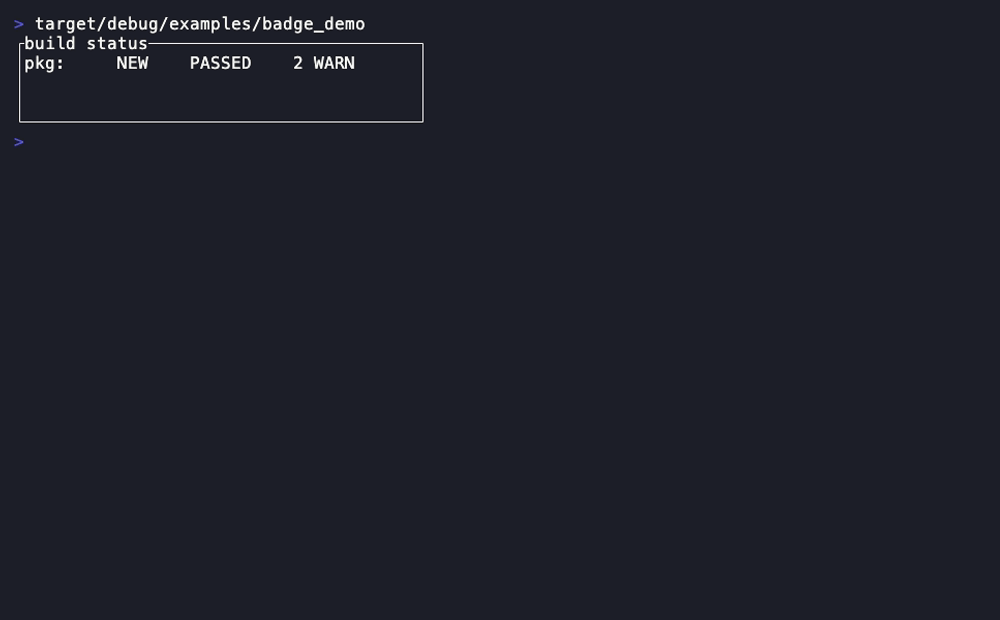

An inline padded level-accented pill. No `Block`; it fills only the pill cells.

- **Companion types:** `BadgeLevel` (`Neutral`/`Info`/`Success`/`Warning`/`Error`)
- **State model:** pure projection of caller-owned label + level.

```rust
Badge::new(impl Into<Line>)
.level(BadgeLevel) .padding(u16)
```

**Demo:** `cargo run -p rstui-widgets --example badge_demo`

---

## Alert

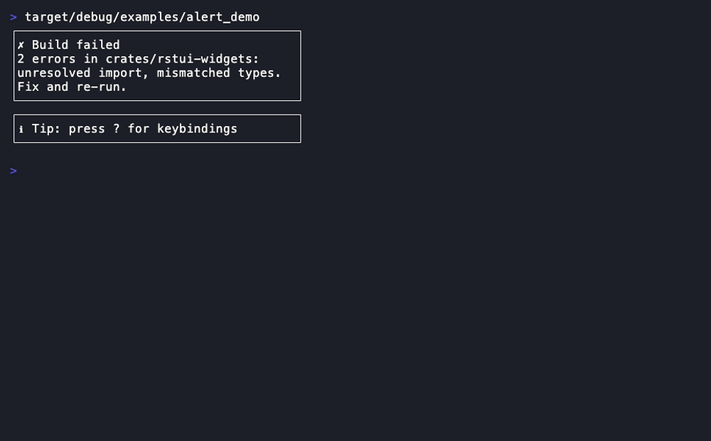

A persistent level-accented banner with an icon, title and optional wrapped
body — the non-transient sibling of [`Toast`](core-set.md#toast).

- **Companion types:** `AlertLevel` (`Info`/`Success`/`Warning`/`Error`)
- **State model:** pure projection of caller-owned title/body/level.

```rust
Alert::new(impl Into<Line>)
.level(AlertLevel) .body(impl Into<Text>) .block(Block)
```

**Demo:** `cargo run -p rstui-widgets --example alert_demo`

---

## Divider

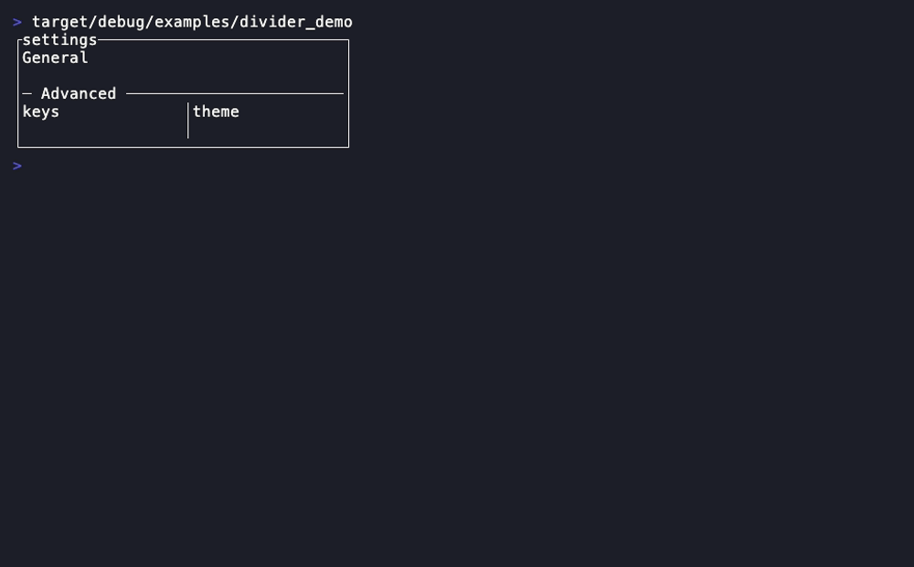

A one-cell-thick rule with an optional caption. No `Block`.

- **Companion types:** `DividerOrientation` (`Horizontal`/`Vertical`)
- **State model:** pure projection of an optional caller-owned label.

```rust
Divider::new()
.orientation(DividerOrientation) .label(impl Into<Line>) .border_type(BorderType)
```

**Demo:** `cargo run -p rstui-widgets --example divider_demo`

---

## DataTable

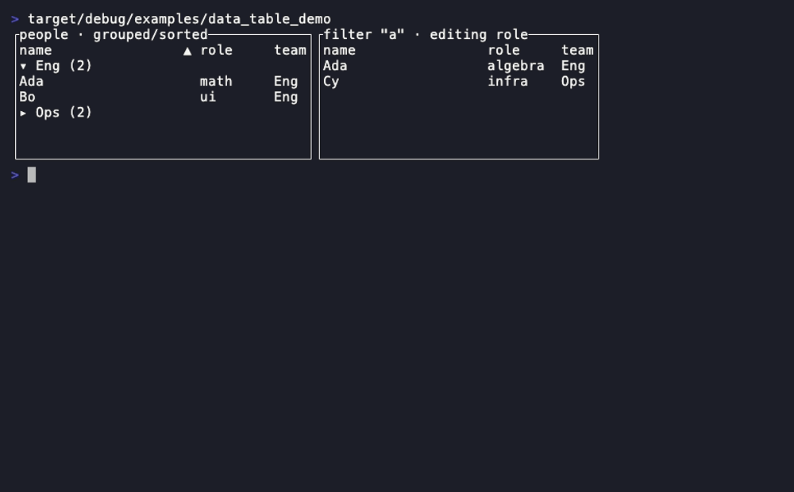

The comprehensive interactive grid: sortable/filterable/groupable,
mouse-hit-testable, virtualized for fast scroll, with **any form field per
cell** — text, checkbox, switch, a dropdown, or *any* widget via
`cell_rect` — the spreadsheet pane to [`Table`](core-set.md#table)'s
aligned rows.

- **Companion types:** `DataColumn`, `DataRow`, `DataTableState`,
  `CellField` (`Text`/`Checkbox`/`Switch`/`Select`), `CellSelectState`,
  `cell_truthy`, `VisualRow` (`Group`/`Data`), `DataTableHit`
  (`Header`/`Group`/`Cell`/`DropdownOption`/`Config*`), `SortDirection`
  (`Ascending`/`Descending`)
- **State model:** pure projection of caller-owned `[DataColumn]` /
  `[DataRow]` / a flattened `[VisualRow]` (from `data_table::project`, run
  by the reducer once per data/spec change) / `DataTableState` (composes
  [`ScrollState`](../core-reference.md#scrollstate)) / an optional editing
  [`TextEdit`](../core-reference.md#textedit) (text cell) /
  `CellSelectState` (open dropdown). A column's `CellField` picks the cell
  control; the widget renders it by **reusing** `Input`/`Checkbox`/`Switch`/
  `Select`, the cell `Line` staying the single value of record (so
  sort/filter keep working and the reducer writes edits back —
  `cell_truthy` for booleans, `CellSelectState::choose` for the dropdown).
  *Any other* widget (Slider/Radio/DatePicker/custom) renders into the rect
  from `cell_rect` — the ADR 0012 accessor escape hatch. The reducer runs
  the filter → **two-tier group/sort** pipeline (the grouping column is
  independent of the ordered multi-key sort: tier 1 lists groups by
  key/`group_direction`, tier 2 sorts rows within each by the sort keys)
  and owns every control's state; change events surface as pure
  `hit`/`cell_rect` accessors, never callbacks. A modal **config-panel
  overlay** (`.config(open)`) lets the user set the group column and the
  multi-key sort independently — hit-tested first, returning the
  `Config*` `DataTableHit`s
  ([ADR 0014](../adr/0014-comprehensive-interactive-datatable.md)).

```rust
DataColumn::new(impl Into<Line>)
.width(Constraint) .editable(bool) .field(CellField) // Text|Checkbox|Switch|Select(opts)
DataTable::new(&[DataColumn], &[DataRow], &[VisualRow], &DataTableState)
.edit(&TextEdit) .cell_select(&CellSelectState) .config(bool) .block(Block)
.column_spacing(u16) .show_header(bool) .style(Style) .header_style(Style)
.group_style(Style) .highlight_style(Style) .cursor_style(Style)
.hit(area: Rect, pos: Position) -> Option<DataTableHit>
.cell_rect(area: Rect, source: usize, column: usize) -> Option<Rect>
// reducer-side: the pipeline + the caller-owned group/sort state
data_table::project(&[DataColumn], &[DataRow], &DataTableState) -> Vec<VisualRow>
DataTableState::{sort_keys, set_sort_keys, push_sort, clear_sort,
                 grouped_by, set_group_by, group_direction,
                 toggle_group_direction}
CellSelectState::{open, close, move_highlight, reveal, choose}
```

**Demo:** `cargo run -p rstui-widgets --example data_table_demo`

---

Next: [Navigation & layout](navigation-and-layout.md) ·
[Overlays & control](overlays-and-control.md) · [Core set](core-set.md) ·
[Rich rendering](rich-rendering.md)
