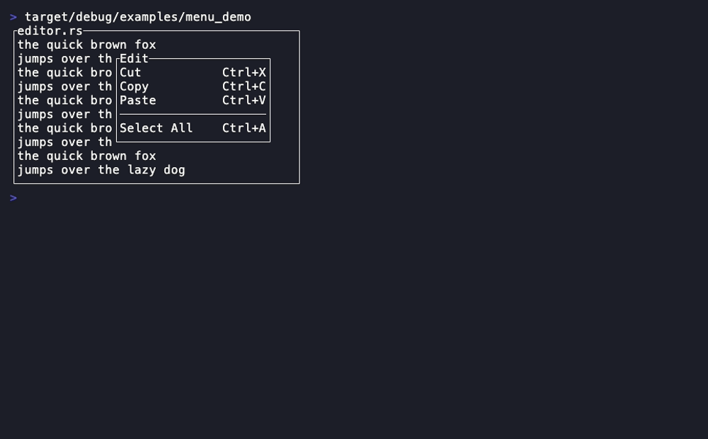
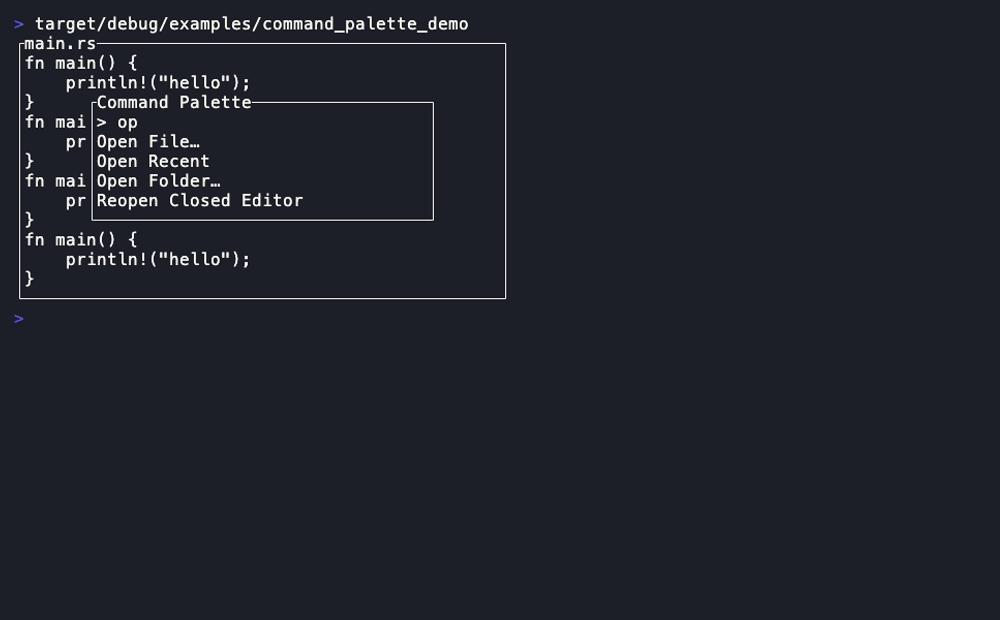
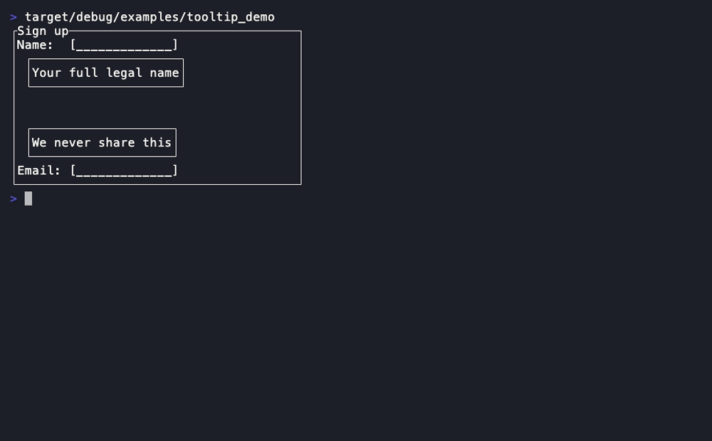
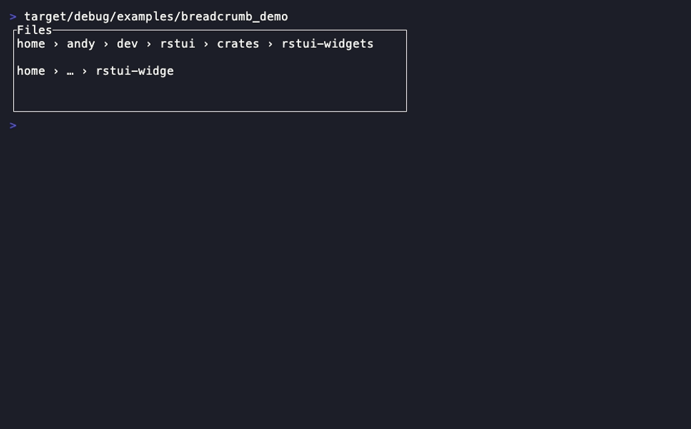
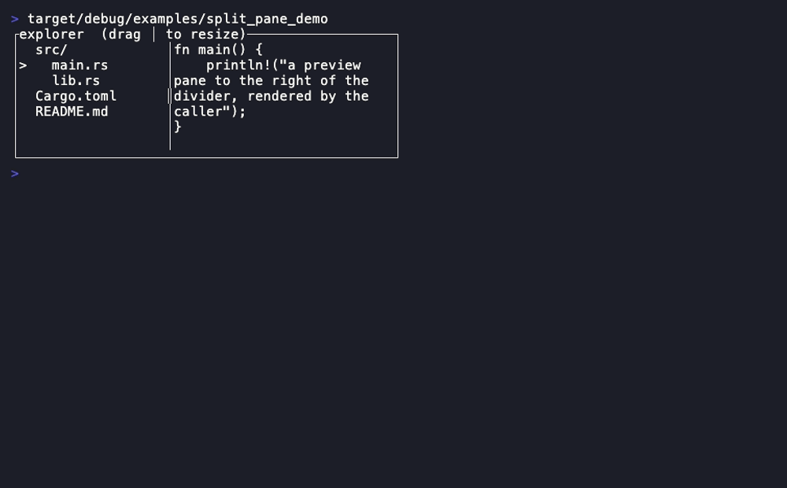
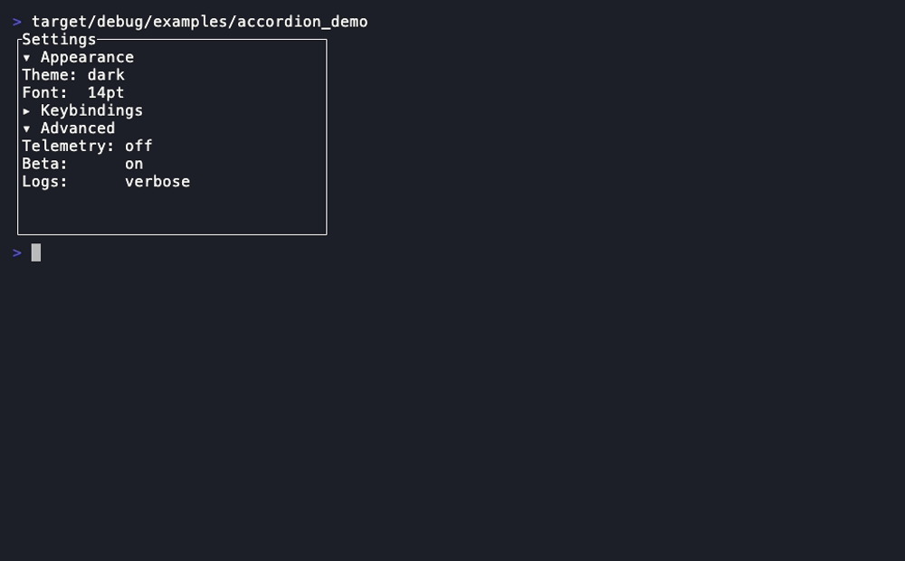
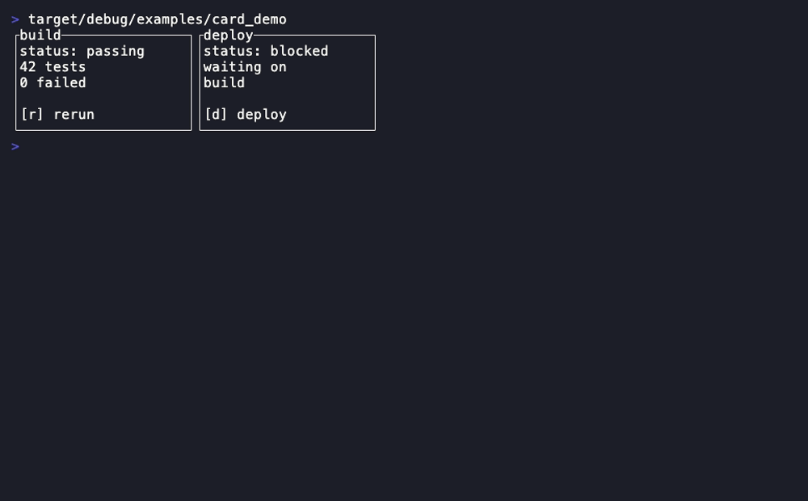
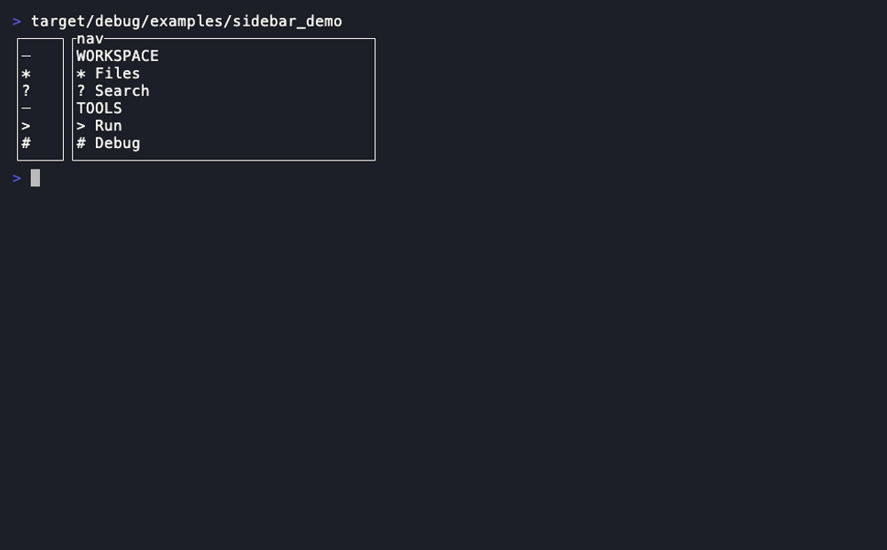
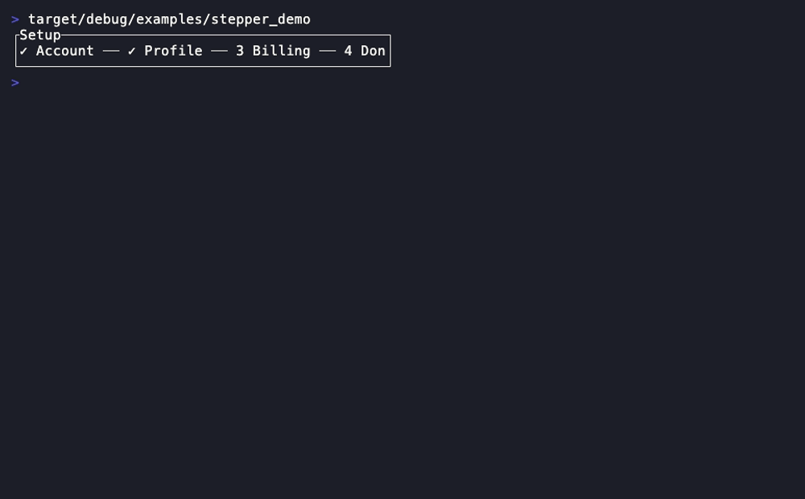
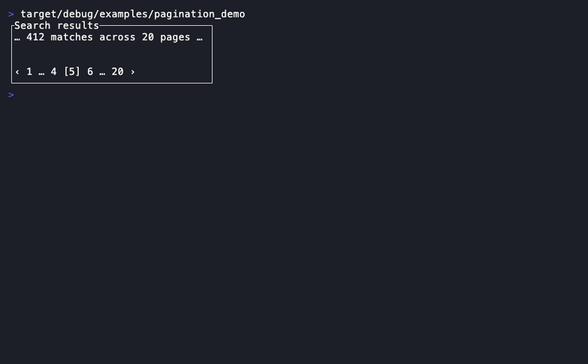

# Navigation & layout

Menus, command palette, breadcrumbs, the structural split/accordion/card
containers, the navigation rail and the progress widgets.
[Back to the component library](README.md).

---

## Menu



An opaque action list with key hints, separators and disabled rows (reuses
[`List`](core-set.md#list)).

- **Companion types:** `MenuItem`
- **State model:** pure projection of caller-owned items + `highlight`/`offset`.

```rust
Menu::new(items: impl IntoIterator)
.highlight(Option<usize>) .offset(usize) .block(Block)
```

**Demo:** `cargo run -p rstui-widgets --example menu_demo`

---

## CommandPalette



A centred opaque fuzzy-command panel — the worked composition of `Input` +
`List` + `Block` + `clear_region`. Filtering/ranking is the reducer's job; the
widget projects the query and the already-filtered results.

- **State model:** pure projection of a borrowed [`TextEdit`](../core-reference.md#textedit) query + a result slice + `highlight`/`offset`.

```rust
CommandPalette::new(query: &TextEdit, results: &[Line])
.highlight(Option<usize>) .offset(usize) .focused(bool)
.prompt(impl Into<Cow<str>>) .width(Constraint) .height(Constraint)
.area(overlay: Rect) -> Rect
```

**Demo:** `cargo run -p rstui-widgets --example command_palette_demo`

---

## Tooltip



A small opaque popup anchored beside a control, flipping side when near an
edge.

- **State model:** pure projection of caller-owned text + an anchor `Rect`.

```rust
Tooltip::new(impl Into<Text>)
.block(Block)
.placement(anchor: Rect, buffer: Rect) -> Rect
```

**Demo:** `cargo run -p rstui-widgets --example tooltip_demo`

---

## Breadcrumb



A one-row path strip with a separator; the last/selected segment is
emphasized and middle segments elide to `…` when space is tight.

- **State model:** pure projection of a caller-owned segment slice + optional `selected`.

```rust
Breadcrumb::new(segments: &[Line])
.selected(Option<usize>) .separator(char) .emphasis_style(Style)
```

**Demo:** `cargo run -p rstui-widgets --example breadcrumb_demo`

---

## SplitPane



Divides an area into two panes by a caller-owned `Constraint` — pure layout.
The resize state (the constraint) lives in your model.

- **State model:** pure layout projection of a caller-owned `Constraint`.

```rust
SplitPane::new(Constraint) / ::horizontal(Constraint) / ::vertical(Constraint)
.divider(char)
.split(area: Rect) -> (Rect, Rect)
.divider_rect(area: Rect) -> Rect
// mouse-resize seam (pure; the reducer owns the drag):
.contains_divider(area: Rect, pos: Position) -> bool   // 1-cell grab tolerance
.resize_to(area: Rect, pos: Position) -> Constraint    // clamped Length, total
```

Mouse-resize is a 3-line reducer — see the recipe + the full widget
mouse-friendliness review in
[composition.md](../composition.md#mouse-resizable-layout-the-ready-made-splitpane-seam).

**Demo:** `cargo run -p rstui-widgets --example split_pane_demo`

---

## Accordion



A stack of titled collapsible sections — pure layout, no child widgets. The
expanded/height state per section is caller-owned.

- **Companion types:** `AccordionSection`
- **State model:** pure layout projection of caller-owned sections (each with `expanded`/`body_height`).

```rust
Accordion::new(sections: impl IntoIterator)
.header_style(Style)
.layout(area: Rect) -> Vec<Option<Rect>>   // None = collapsed section
```

**Demo:** `cargo run -p rstui-widgets --example accordion_demo`

---

## Card



A titled container with header/footer rows — a thin `Block` composition.

- **State model:** pure projection of caller-owned title/header/footer.

```rust
Card::new()
.title(impl Into<Cow<str>>) .header(impl Into<Line>) .footer(impl Into<Line>)
.inner(area: Rect) -> Rect
```

**Demo:** `cargo run -p rstui-widgets --example card_demo`

---

## Sidebar



A navigation rail (icon + label, collapsible groups) in expanded or narrow
mode (reuses [`List`](core-set.md#list)). The kitchen sink's left rail.

- **Companion types:** `SidebarItem`
- **State model:** pure projection of caller-owned items + `selected`/`offset`/`collapsed`.

```rust
Sidebar::new(items: impl IntoIterator)
.selected(Option<usize>) .offset(usize) .collapsed(bool)
```

**Demo:** `cargo run -p rstui-widgets --example sidebar_demo`

---

## Stepper



Wizard progress steps (numbered / checkmark) on one row or column.

- **Companion types:** `Step`, `StepperOrientation` (`Horizontal`/`Vertical`)
- **State model:** pure projection of caller-owned steps + `current` index.

```rust
Stepper::new(steps: impl IntoIterator)
.current(usize) .orientation(StepperOrientation)
```

**Demo:** `cargo run -p rstui-widgets --example stepper_demo`

---

## Pagination



A windowed pager (`‹ 1 … 4 [5] 6 … ›`). No lifetime.

- **State model:** pure projection of caller-owned `page` (0-based) + `page_count`.

```rust
Pagination::new(page: usize, page_count: usize)
.siblings(usize)
```

**Demo:** `cargo run -p rstui-widgets --example pagination_demo`

---

Next: [Overlays & control](overlays-and-control.md) · [Core set](core-set.md) ·
[Rich rendering](rich-rendering.md) · [Forms & data](forms-and-data.md)
