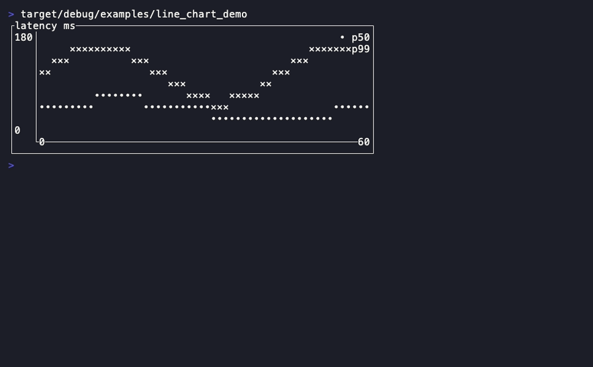
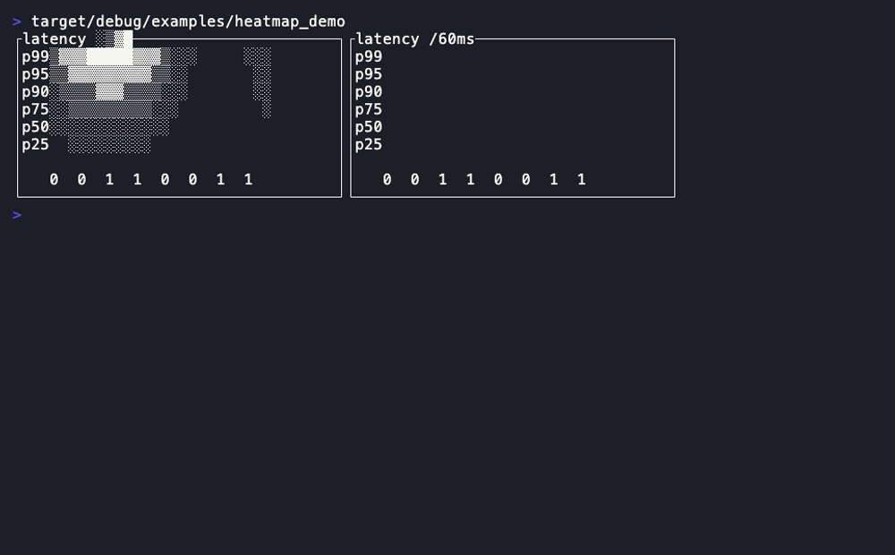
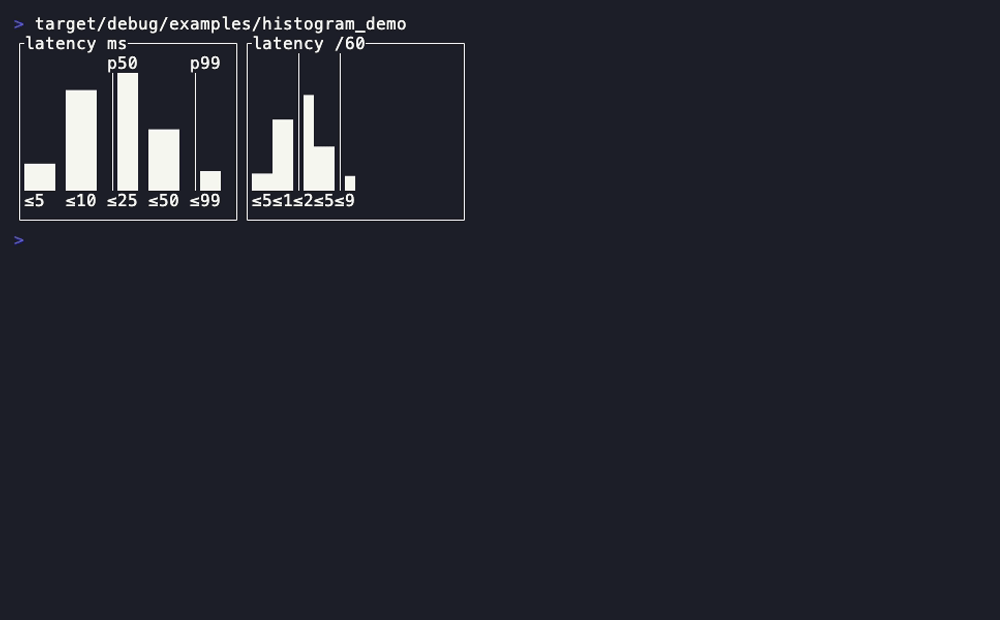
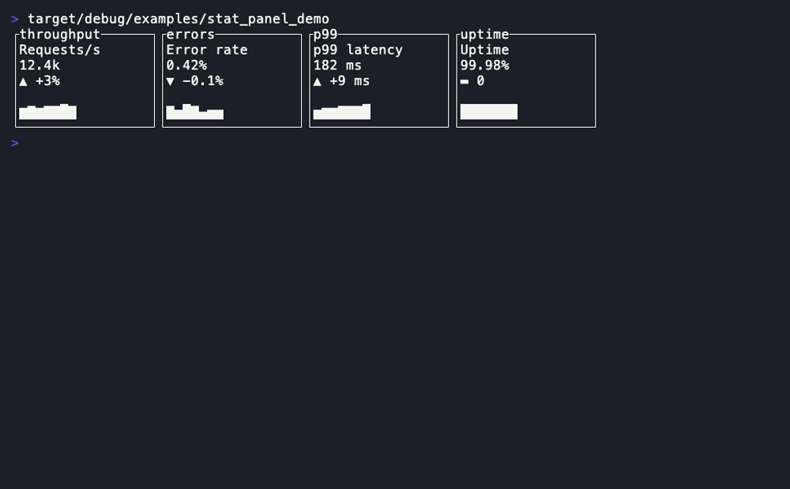
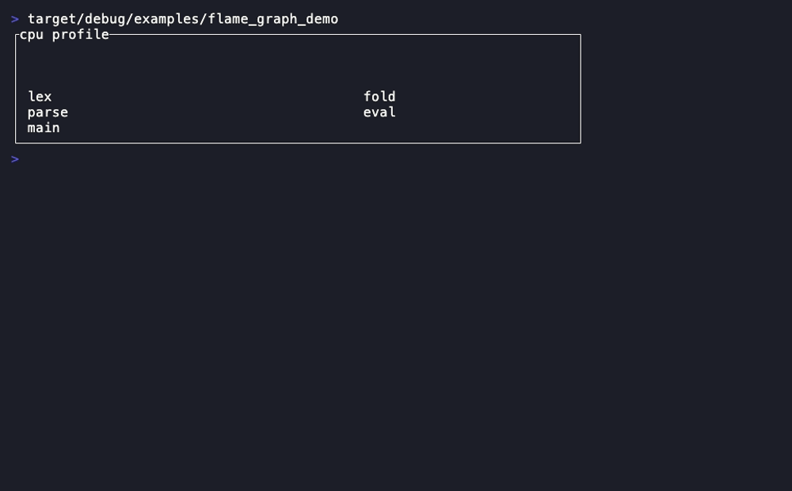
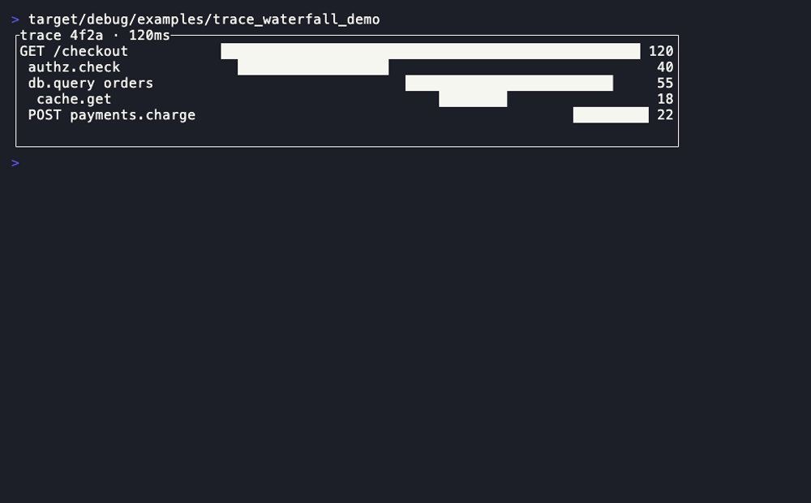
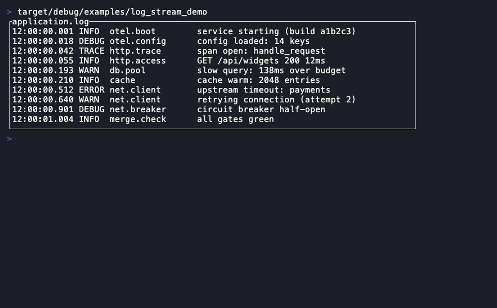

# Observability

The metrics / traces / logs primitives an OpenTelemetry-style dashboard is
built from. Every one is the same **pure projection** of caller-owned series
the rest of the catalog is — the reducer owns the ring buffer / span list, the
widget only draws "the data right now", and every degenerate input clips or
no-ops. [Back to the component library](README.md).

---

## LineChart



A multi-series XY line chart inside framed axes — the core "metric over time"
panel (request rate, p99 latency, CPU), the continuous-curve sibling of the
categorical `BarChart`.

- **Companion types:** `Series` (name, points, style, marker), `AxisBounds`
  (min/max for one axis)
- **State model:** pure projection of a caller-owned `&[Series]` (each a
  `&[(f64, f64)]`); bounds are auto-derived from the data union when unset.

```rust
LineChart::new(series: &[Series])
.x_bounds(AxisBounds) .y_bounds(AxisBounds)
.style(Style) .axis_style(Style) .block(Block) .legend(bool)

Series::new(name: impl Into<Line>, points: &[(f64, f64)])
.style(Style) .marker(char)
AxisBounds::new(min: f64, max: f64)
```

**Demo:** `cargo run -p rstui-widgets --example line_chart_demo`

---

## Heatmap



A 2-D value grid mapped to a shade or colour ramp — the latency-over-time /
per-service error-density grid. A flat row-major `&[f64]` plus a column count
(total on a short final row).

- **State model:** pure projection of a caller-owned `&[f64]` + `cols`; the
  range is auto-derived when `min`/`max` are unset.

```rust
Heatmap::new(values: &[f64], cols: usize)
.min(Option<f64>) .max(Option<f64>)
.glyph_ramp(bool) .low_color(Color) .high_color(Color)
.cell_width(u16) .row_labels(&[&str]) .col_labels(&[&str])
.label_style(Style) .style(Style) .block(Block)
```

**Demo:** `cargo run -p rstui-widgets --example heatmap_demo`

---

## Histogram



A bucketed value-distribution chart with `p50`/`p95`/`p99` marker overlays —
the distribution sibling of categorical `BarChart` (the shared eighth-block
sub-cell ramp).

- **Companion types:** `HistogramBucket` (count + boundary label),
  `Percentile` (fraction + label + style)
- **State model:** pure projection of a caller-owned `&[HistogramBucket]` and
  an optional `&[Percentile]`; scaled to the largest count when `max` is unset.

```rust
Histogram::new(buckets: &[HistogramBucket])
.max(Option<u64>) .bar_width(u16) .bar_gap(u16)
.percentiles(&[Percentile])
.bar_style(Style) .label_style(Style) .style(Style) .block(Block)

HistogramBucket::new(count: u64, label: impl Into<Line>)
Percentile::new(fraction: f64, label: impl Into<Line>) .style(Style)
```

**Demo:** `cargo run -p rstui-widgets --example histogram_demo`

---

## StatPanel



The single big KPI tile — a headline value with a caption, a trend delta, and
an optional inline sparkline backdrop; the observability tile `Card`
generalizes to.

- **Companion types:** `Trend` (`Up`/`Down`/`Flat`)
- **State model:** pure projection of caller-owned value/caption/delta `Line`s
  and an optional `&[u64]` sparkline series (auto-scaled).

```rust
StatPanel::new(value: impl Into<Line>)
.caption(impl Into<Line>) .delta(impl Into<Line>) .trend(Trend)
.sparkline(&[u64])
.value_style(Style) .caption_style(Style) .trend_style(Style)
.spark_style(Style) .style(Style) .block(Block)
```

**Demo:** `cargo run -p rstui-widgets --example stat_panel_demo`

---

## FlameGraph



A flame / icicle graph of a caller-owned **flattened** frame list (the `Tree`
discipline) — the CPU / trace profile view.

- **Companion types:** `FlameFrame` (depth, start, width, label, style)
- **State model:** pure projection of a caller-owned `&[FlameFrame]` plus an
  optional `selected` index; the reducer owns zoom/expansion.

```rust
FlameGraph::new(frames: &[FlameFrame])
.total(Option<u64>) .row_height(u16) .inverted(bool)
.selected(Option<usize>) .selected_style(Style) .style(Style) .block(Block)

FlameFrame::new(depth: u16, start: u64, width: u64, label: impl Into<Line>)
.style(Style)
```

**Demo:** `cargo run -p rstui-widgets --example flame_graph_demo`

---

## TraceWaterfall



A distributed-trace span waterfall on a shared time axis (the `BarChart`
sub-cell ramp) — spans flattened in display order like `Tree`.

- **Companion types:** `TraceSpan` (depth, start, duration, name, style)
- **State model:** pure projection of a caller-owned `&[TraceSpan]` plus an
  optional `selected` index; the reducer owns selection/expansion.

```rust
TraceWaterfall::new(spans: &[TraceSpan])
.total(Option<u64>) .name_width(u16) .selected(Option<usize>)
.duration_labels(bool)
.selected_style(Style) .bar_style(Style) .name_style(Style)
.style(Style) .block(Block)

TraceSpan::new(depth: u16, start: u64, duration: u64, name: impl Into<Line>)
.style(Style)
```

**Demo:** `cargo run -p rstui-widgets --example trace_waterfall_demo`

---

## LogStream



A structured, severity-coloured log viewer projecting a caller-owned scroll
`offset` exactly like `List` — the OTel log-records pane.

- **Companion types:** `LogRecord` (level, timestamp, target, message),
  `LogLevel` (`Trace`/`Debug`/`Info`/`Warn`/`Error`), `LogPalette` (the
  per-level colours)
- **State model:** pure projection of a caller-owned `&[LogRecord]` + the
  scroll `offset` (the reducer owns the buffer and the offset).

```rust
LogStream::new(records: &[LogRecord])
.offset(usize) .palette(LogPalette)
.show_timestamp(bool) .show_target(bool)
.timestamp_width(u16) .target_width(u16)
.timestamp_style(Style) .target_style(Style) .message_style(Style)
.style(Style) .block(Block)

LogRecord::new(level: LogLevel, message: impl Into<Line>)
.timestamp(impl Into<Line>) .target(impl Into<Line>)
LogPalette { trace, debug, info, warn, error: Color }   // ::default(), .color(LogLevel)
```

**Demo:** `cargo run -p rstui-widgets --example log_stream_demo`
