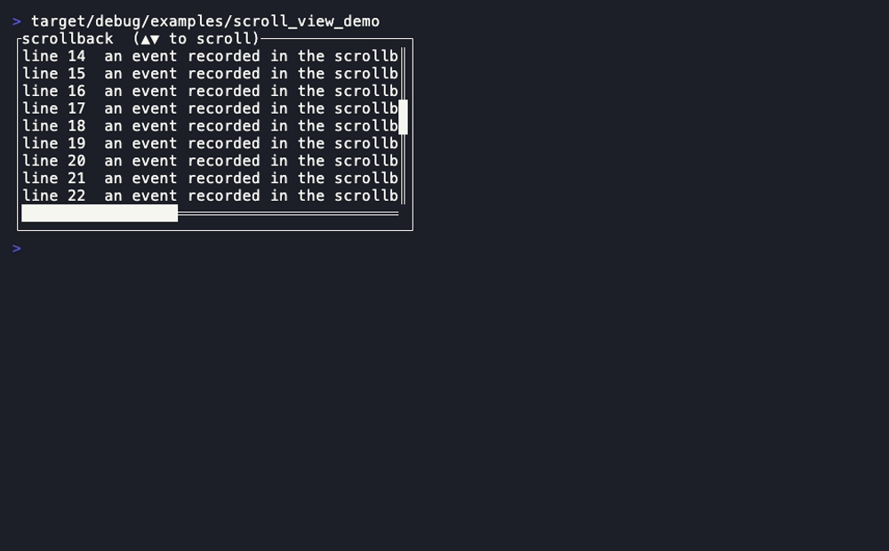
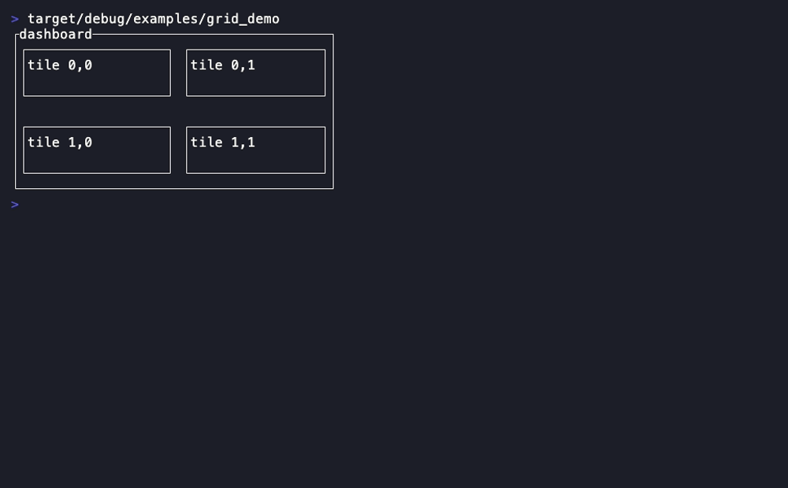
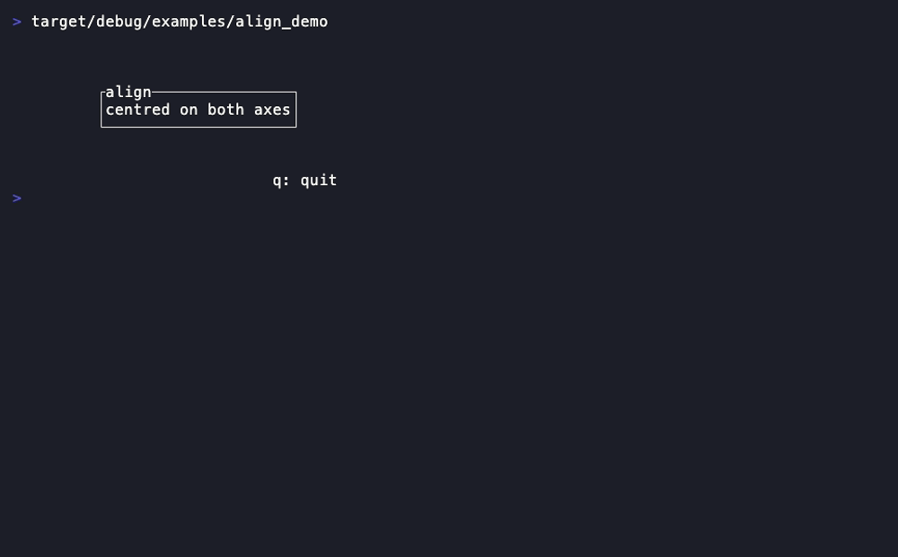
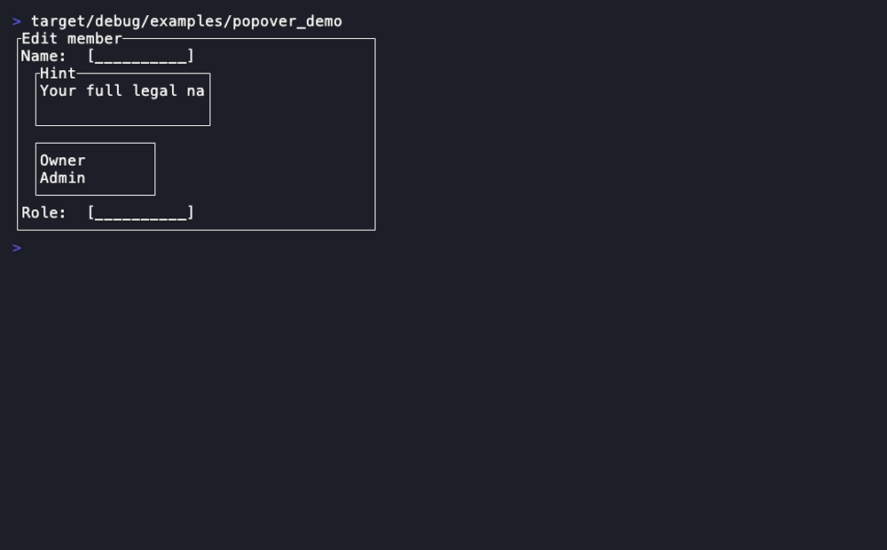
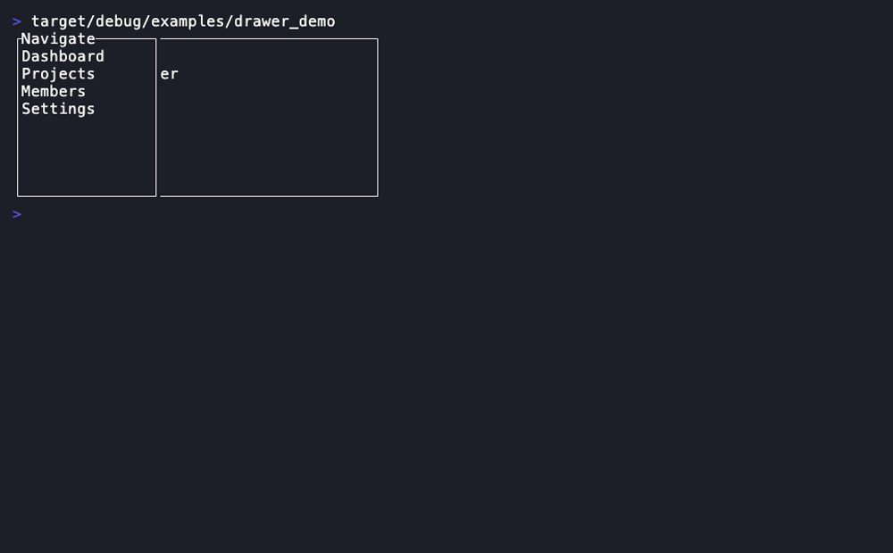
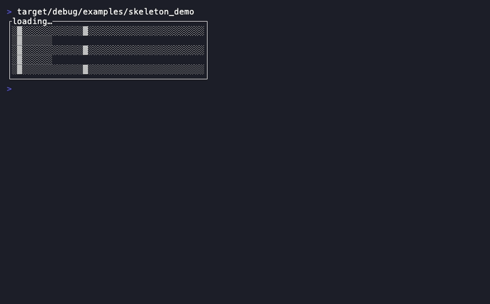
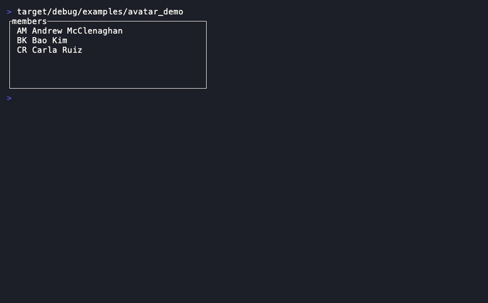
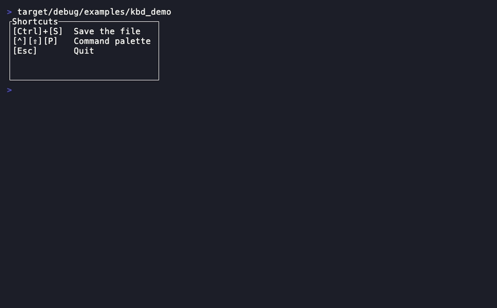
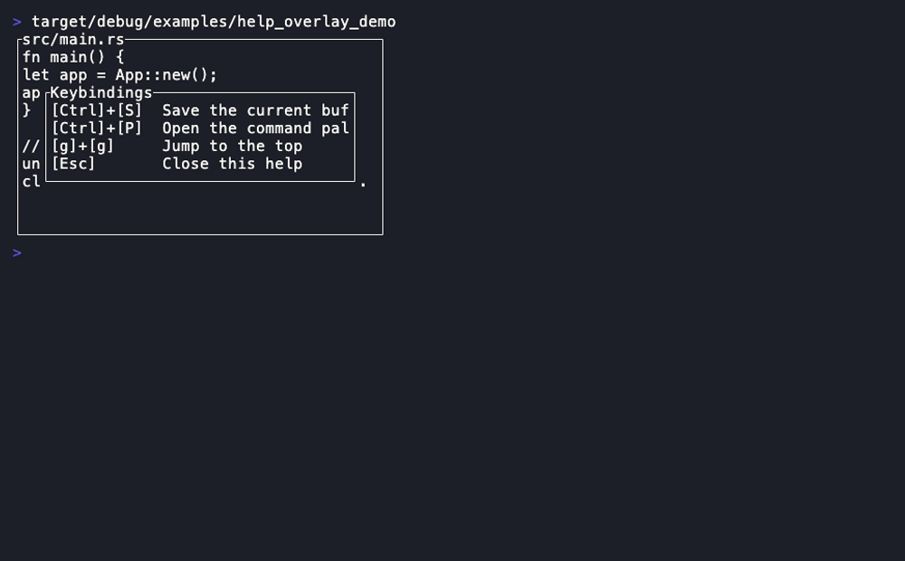
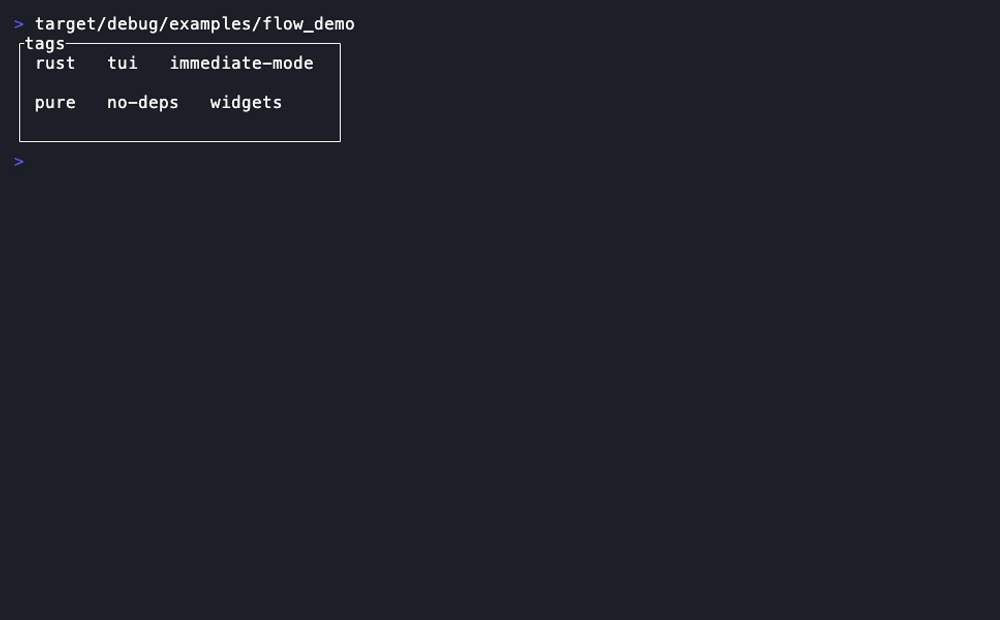

# Overlays & control

The layout/overlay primitives and the small control affordances.
[Back to the component library](README.md).

---

## ScrollView



A clipping viewport over an oversized content `Buffer` with an automatic
`Scrollbar`. Immediate-mode: you render content into a scratch `Buffer`, then
project a window of it.

- **State model:** pure projection; borrows a caller-owned content `Buffer` + offsets.

```rust
ScrollView::new(content: &Buffer)
.offset(col: u16, row: u16) .vertical_scrollbar(bool) .horizontal_scrollbar(bool)
.viewport(area: Rect) -> Rect                       // the visible content rect
// mouse seam — hit-test, then Scrollbar::position_at for the new offset:
.vertical_scrollbar_rect(area: Rect) -> Option<Rect>
.horizontal_scrollbar_rect(area: Rect) -> Option<Rect>
```

**Demo:** `cargo run -p rstui-widgets --example scroll_view_demo`

---

## Grid



A 2-D layout tiling an area into rows × columns of cells (reuses
[`Layout`](../core-reference.md#layout) per axis). Pure layout.

- **State model:** pure layout projection of caller-owned `Constraint` lists.

```rust
Grid::new(rows, columns)  / .rows(iter) / .columns(iter)
.split(area: Rect) -> Vec<Vec<Rect>>
.cell(area: Rect, row: usize, col: usize) -> Option<Rect>
```

**Demo:** `cargo run -p rstui-widgets --example grid_demo`

---

## Align



Places a child `Rect` within an area on both axes — the `Modal`-centring math,
generalized. Pure layout.

- **Companion types:** `VerticalAlignment` (`Top`/`Center`/`Bottom`)
- **State model:** pure layout — no state.

```rust
Align::new()
.width(Constraint) .height(Constraint)
.horizontal(Alignment) .vertical(VerticalAlignment)
.rect(area: Rect) -> Rect
```

**Demo:** `cargo run -p rstui-widgets --example align_demo`

---

## Popover



A generic anchored opaque floating panel — the shared shape `Tooltip`, `Menu`
and `Select` are built on.

- **Companion types:** `PopoverSide` (`Bottom`/`Top`/`Right`/`Left`)
- **State model:** pure projection of a caller-owned anchor `Rect`.

```rust
Popover::new()
.width(u16) .height(u16) .side(PopoverSide) .block(Block)
.placement(anchor: Rect, buffer: Rect) -> Rect
.inner(anchor: Rect, buffer: Rect) -> Rect
```

**Demo:** `cargo run -p rstui-widgets --example popover_demo`

---

## Drawer



An edge-anchored side sheet over an opaque overlay, with an optional `Block`.
The kitchen sink's settings panel.

- **Companion types:** `DrawerSide` (`Left`/`Right`/`Top`/`Bottom`)
- **State model:** pure projection of a caller-owned `open: bool`.

```rust
Drawer::new()
.open(bool) .side(DrawerSide) .size(Constraint) .backdrop_style(Style)
.panel(overlay: Rect) -> Rect
.inner(overlay: Rect) -> Rect
```

**Demo:** `cargo run -p rstui-widgets --example drawer_demo`

---

## Skeleton



A loading placeholder with a sweeping shimmer column — driven by a frame tick,
no wall clock.

- **Companion types:** `SkeletonShape` (`Block`/`Lines(u16)`)
- **State model:** pure projection of a caller-owned `tick: usize`.

```rust
Skeleton::new()
.tick(usize) .shape(SkeletonShape)
```

**Demo:** `cargo run -p rstui-widgets --example skeleton_demo`

---

## Avatar



A small initials swatch (1–3 characters centred) on an accent fill.

- **State model:** pure projection of a caller-owned initials string.

```rust
Avatar::new(initials: impl Into<Cow<str>>)
.style(Style)
```

**Demo:** `cargo run -p rstui-widgets --example avatar_demo`

---

## Kbd



An inline keycap cluster (`[Ctrl]+[K]`). No `Block`, no label. Reused by
`HelpOverlay`.

- **State model:** pure projection of a caller-owned key-label slice.

```rust
Kbd::new(keys: impl IntoIterator)
.separator(impl Into<Cow<str>>)
.delimiters(open: impl Into<Cow<str>>, close: impl Into<Cow<str>>)
.key_style(Style)
```

**Demo:** `cargo run -p rstui-widgets --example kbd_demo`

---

## HelpOverlay



A centred opaque keybinding cheat-sheet (the `Kbd` + `Modal` idiom). The
kitchen sink's `?` panel.

- **Companion types:** `HelpEntry`
- **State model:** pure projection of a caller-owned `&[HelpEntry]`.

```rust
HelpOverlay::new(entries: &[HelpEntry])
.width(Constraint) .height(Constraint)
.separator(impl Into<Cow<str>>) .block(Block)
```

**Demo:** `cargo run -p rstui-widgets --example help_overlay_demo`

---

## KeymapView


`HelpOverlay`'s **interactive** sibling: a keybinding *table* with a
selection cursor, a per-row state (selected / capturing / disabled), an
optional id column, scroll windowing, and `hit()` for click-to-rebind —
the reusable "see and remap your keys" panel. Engine-agnostic: any
`(label, keys, state)` source drives it (no keymap-engine dependency, so
`rstui-widgets` stays `rstui-core`-only). Reuses `Kbd` for the key caps.
Used by the kitchen sink, acp-client and git-review settings panels;
adapts straight from [`rstui-keymap`](../keymaps.md)'s `keys_for`.

- **Companion types:** `KeymapRow`, `RowState` (`Normal`/`Selected`/`Capturing`/`Disabled`)
- **State model:** pure projection of a caller-owned `&[KeymapRow]` + the
  reducer-owned selection / capture FSM.

```rust
KeymapView::new(rows: &[KeymapRow])
.header(impl Into<Line>) .footer(impl Into<Line>)
.scroll(usize) .block(Block) .separator(impl Into<Cow<str>>)
.hit(area, pos) -> Option<usize>   // click → source row
```

**Demo:** `cargo run -p rstui-widgets --example keymap_view_demo`

---

## Flow



A wrapped horizontal run of `Line`s — a flex-wrap pill row. Pure layout.

- **State model:** pure layout projection of a caller-owned `Line` slice.

```rust
Flow::new(items: impl IntoIterator)
.horizontal_gap(u16) .vertical_gap(u16)
.layout(area: Rect) -> Vec<Rect>    // one rect per item, wrapped
```

**Demo:** `cargo run -p rstui-widgets --example flow_demo`

---

That's the full set. Back to the [component library index](README.md), or see
how they compose into a real screen in
[`docs/composition.md`](../composition.md) and the `gallery` example.
