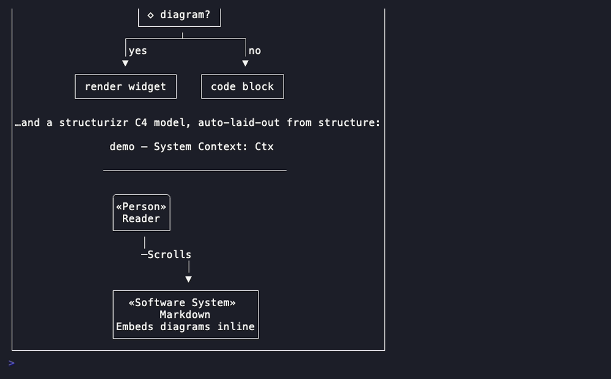
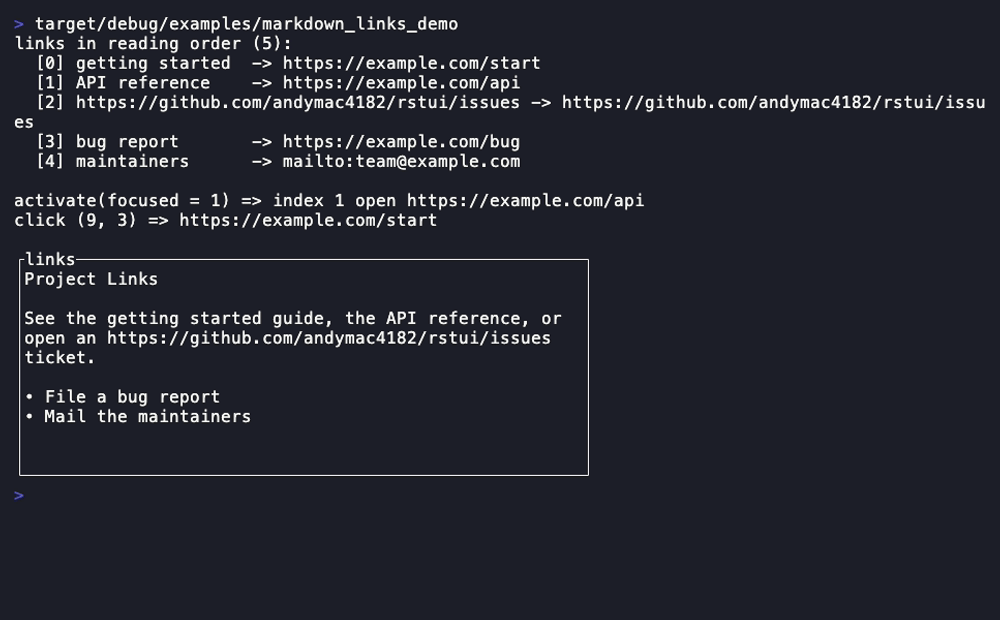
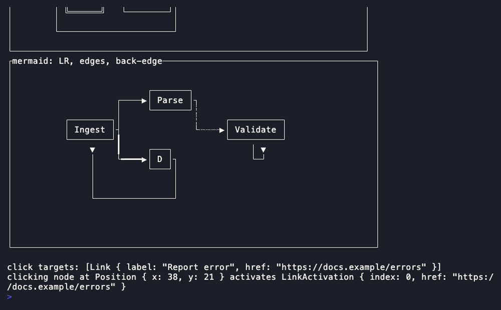
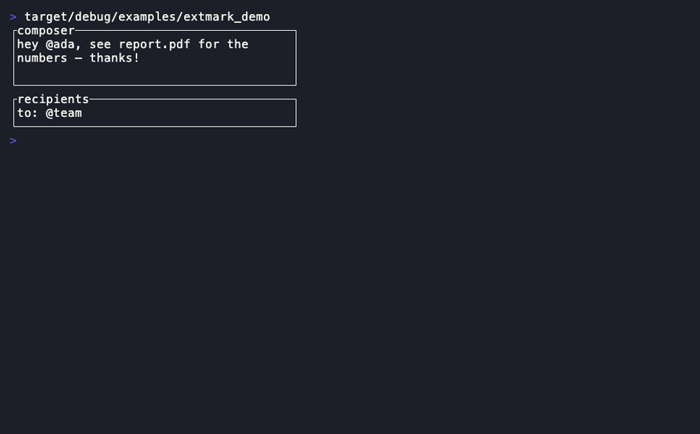

# Rich rendering

Read-only document renderers with hand-written parsers (no external parsing
dependency — [ADR 0002](../adr/0002-widget-crate-boundary.md)) plus the
character-range overlay primitive. [Back to the component library](README.md).

---

## Markdown



A read-only CommonMark-ish renderer: headings, emphasis, inline + fenced code,
tables, lists, links — with a hand-written parser. Exposes link regions so the
reducer can implement focus/activation.

- **Companion types:** `MarkdownTheme`, `LinkRegion`, [`Link`](#link)
- **State model:** pure projection of caller-owned markdown source + optional focused-link index.

```rust
Markdown::new(src: &str)
.theme(MarkdownTheme) .focused_link(Option<usize>)
.links() -> Vec<Link>               // for keyboard focus/activation
.link_regions() -> Vec<LinkRegion>  // hit-test rectangles
.link_at(pos: Position) -> Option<usize>
```

**Demo:** `cargo run -p rstui-widgets --example markdown_demo`

---

## Link



The link-span model (label + href) and the activation event shape `Markdown`
and `Mermaid` share. A pure data structure, not a projection.

- **Companion types:** `LinkActivation`

```rust
Link::new(label: impl Into<Cow<str>>, href: impl Into<Cow<str>>)
Link::activate(index: usize) -> LinkActivation
```

**Demo:** `cargo run -p rstui-widgets --example markdown_links_demo`

---

## Diff


A unified-diff parser with a line-number gutter, a three-colour scheme and
intra-line word highlighting. Unified or split (side-by-side) layout.

- **Companion types:** `DiffLayout` (`Unified`/`Split`), `DiffTheme`
- **State model:** pure projection of caller-owned diff source text.

```rust
Diff::new(src: &str)
.layout(DiffLayout) .side_by_side() .syntax(bool) .theme(DiffTheme)
```

**Demo:** `cargo run -p rstui-widgets --example diff_demo`

---

## Mermaid



A Mermaid flowchart-subset parser that lays out a **deterministic**
box-and-arrow diagram (no layout engine, no float jitter — same input, same
diagram, every time).

- **Companion types:** `MermaidError`, `MermaidTheme`, `MermaidGraph` (AST), [`Link`](#link)
- **State model:** pure projection of caller-owned Mermaid source + optional focused link.

```rust
Mermaid::new(src: &str)
.theme(MermaidTheme)
.links() -> Vec<Link>  .link_regions() -> Vec<LinkRegion>
.link_at(pos: Position) -> Option<usize>
```

**Demo:** `cargo run -p rstui-widgets --example mermaid_demo`

---

## Extmark



A styled character-index range overlay (Neovim-style "extmark"): the model for
`@`-mention pills and inline highlights, optionally *atomic* (cursor skips
over it as a unit). Consumed by `Input` and `Editor`.

- **State model:** pure data — the reducer owns and re-derives the list each frame.

```rust
Extmark::new(range: Range<usize>, style: Style)
Extmark::pill(range: Range<usize>, style: Style)
```

**Demo:** `cargo run -p rstui-widgets --example extmark_demo`

---

## LineNumberGutter


A right-aligned numeric gutter with an optional per-row sign column and an
inner accessor — the gutter `Editor`/`Diff`-style views render beside.

- **State model:** pure layout projection of caller-owned line-number metadata.

```rust
LineNumberGutter::new(first: u64, rows: usize)
.signs(&[char]) .row_styles(&[Style])
.inner(area: Rect) -> Rect          // the text rect beside the gutter
```

**Demo:** `cargo run -p rstui-widgets --example line_number_gutter_demo`

---

Next: [Forms & data](forms-and-data.md) ·
[Navigation & layout](navigation-and-layout.md) ·
[Overlays & control](overlays-and-control.md) · [Core set](core-set.md)
