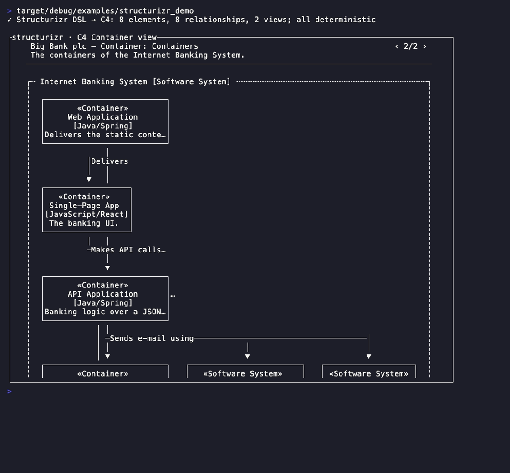
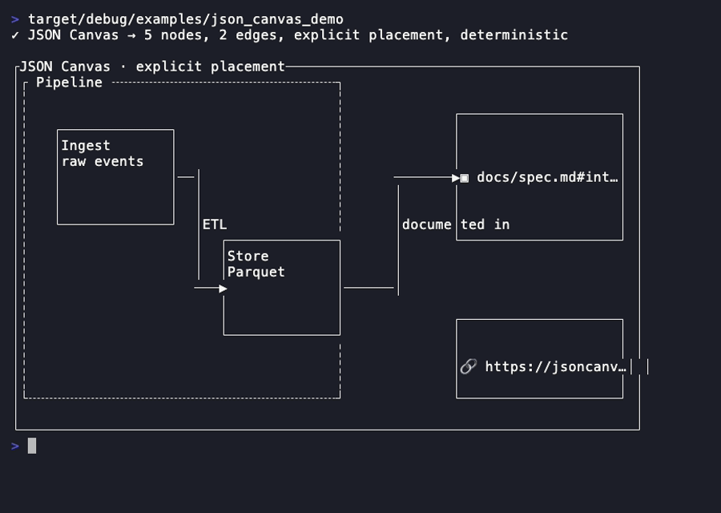

# Rich rendering

Read-only document renderers with hand-written parsers (no external parsing
dependency — [ADR 0002](../adr/0002-widget-crate-boundary.md)) plus the
character-range overlay primitive. [Back to the component library](README.md).

---

## Markdown


A read-only CommonMark-ish renderer: headings, emphasis, inline + fenced code,
tables, lists, links — with a hand-written parser. Exposes link regions so the
reducer can implement focus/activation.

With `.diagrams(true)` a fenced ` ```mermaid `, ` ```structurizr `, or
` ```canvas ` block is rasterised **inline into the document flow** as the
diagram it describes — the renderer hands the fence body to
[Mermaid](#mermaid) / [Structurizr](#structurizr) / [JsonCanvas](#jsoncanvas)
and splices the drawn rows between the prose, scrolled and clamped like the
text around them. It is **off by default** (the fence stays a verbatim code
block), so `Markdown::new` is byte-identical — a purely additive opt-in, the
same total projection `rstui_ai::stream_markdown` uses for an inline diagram
([ADR 0012](../adr/0012-widget-composition-and-layout-model.md)). A
non-diagram fence is untouched and an unparseable diagram degrades to the
renderer's own placeholder, never a panic.

A diagram parse+layout is a `widget/markdown/render`-class cost *per
diagram* — far more than the cheap prose re-wrap immediate mode assumes —
so a screen that embeds diagrams *and* animates pays it every idle frame
(~4.4 ms for one Mermaid + one Structurizr, and a clamp-in-view screen
measures twice a frame). Attach a caller-owned `DiagramCache` with
`.diagram_cache(&cache)`: the fence body is immutable, so its rasterised
rows are memoised by `(source, width)` — the first frame at a width
misses and computes them (byte-identical), every later frame is an `O(1)`
lookup (a Mermaid+Structurizr doc went 4.70 ms → 31 µs, restoring 60 fps).

The **prose** parse+layout is itself the heaviest widget cost —
`widget/markdown/render` ≈ 1.5 ms, ~18 % of a 120 fps frame, re-run every
frame (and *twice* by a scroll-clamp screen). Attach a caller-owned
`MarkdownCache` with `.cache(&cache)`: the lines are a pure function of
`(source, width, focused-link, diagrams, theme)` — every input keyed
(a source-only cache would render stale link highlighting, the real MD-1
wrinkle), so the first frame misses and computes on the unchanged path and
every later frame is `O(1)` (the 120-section doc went **1.49 ms → 0.10 ms**,
~15×). Both caches are the one caller-owned-cache model
([ADR 0025](../adr/0025-caller-owned-line-cache.md), amending
[ADR 0012](../adr/0012-widget-composition-and-layout-model.md) §P1; one
internal `LineCache`); with neither attached the widget is exactly as
before, byte-identical (gate-enforced).

- **Companion types:** `MarkdownTheme`, `LinkRegion`, `MarkdownCache`, `DiagramCache`, [`Link`](#link)
- **State model:** pure projection of caller-owned markdown source + optional focused-link index; `MarkdownCache`/`DiagramCache` (if attached) are caller-owned model state, read through like a `ScrollState`.

```rust
Markdown::new(src: &str)
.theme(MarkdownTheme) .focused_link(Option<usize>)
.diagrams(bool)                     // opt-in: ```mermaid/```structurizr/```canvas → inline diagram
.cache(&MarkdownCache)              // memoise the whole parse+layout — 1.49ms → 0.10ms
.diagram_cache(&DiagramCache)       // memoise embedded diagrams by (source,width)
.links() -> Vec<Link>               // for keyboard focus/activation
.link_regions() -> Vec<LinkRegion>  // hit-test rectangles
.link_at(pos: Position) -> Option<usize>
```

**Demo:** `cargo run -p rstui-widgets --example markdown_demo`

---

## Link


The link-span model (label + href) and the activation event shape `Markdown`
and `Mermaid` share. A pure data structure, not a projection.

- **Companion types:** `LinkActivation`

```rust
Link::new(label: impl Into<Cow<str>>, href: impl Into<Cow<str>>)
Link::activate(index: usize) -> LinkActivation
```

**Demo:** `cargo run -p rstui-widgets --example markdown_links_demo`

---

## Mermaid


One read-only widget that renders **any** Mermaid diagram. It dispatches on
the header keyword to a hand-written per-type parser + **deterministic**
integer layout (no layout engine, no float jitter — same source, same
picture, every time): `flowchart`/`graph` (the original bus-routed
box-and-arrow renderer), `sequenceDiagram`, `classDiagram`,
`stateDiagram-v2`, `erDiagram`, `journey`, `gantt`, `pie`, `quadrantChart`,
`requirementDiagram`, `gitGraph`, `mindmap`, `timeline`, `sankey-beta`,
`xychart-beta`, `block-beta`, `packet-beta`, `kanban`, `architecture-beta`,
`radar-beta`, the `C4*` family, and `zenuml`. An unrecognised header
degrades to a legible placeholder, never a panic; non-flowchart types share
one `Surface` toolkit and approximate non-textual shapes honestly (a radar
is a polygon of spokes, a mindmap a left-rooted bracket tree). Zero new
dependencies — every parser is line-oriented and lenient. Embeds **inline**
in a [Markdown](#markdown) document — a fenced ` ```mermaid ` block — when
the document is built with `.diagrams(true)`.

- **Companion types:** `MermaidError`, `MermaidTheme`, `MermaidGraph` (flowchart AST), [`Link`](#link)
- **State model:** pure projection of caller-owned Mermaid source + optional focused link.

```rust
Mermaid::new(src: &str)
.theme(MermaidTheme)
.links() -> Vec<Link>  .link_regions() -> Vec<LinkRegion>
.link_at(pos: Position) -> Option<usize>
```

**Demo:** `cargo run -p rstui-widgets --example mermaid_demo`

---

## Structurizr



A read-only [Structurizr DSL](https://docs.structurizr.com/dsl/language)
view: parses a real subset of the C4-model DSL (`workspace` → `model` of
`person`/`softwareSystem`/nested `container`/`component` + `->`
relationships, and `views`) and lays out the selected view as a
**deterministic** C4 diagram — stereotyped element cards, a dashed boundary
box around a system's containers, and labelled relationship arrows, with a
`‹ k/n ›` view pager. A *separate* diagramming language from
[Mermaid](#mermaid), so a separate widget; the two share one internal
drawing surface (`crate::diagram`) rather than reinventing rasterisation.
Hand-written brace/quote/comment-aware parser, zero new dependencies,
lenient (an unparseable line is skipped, never a panic). Embeds **inline**
in a [Markdown](#markdown) document — a fenced ` ```structurizr ` block —
when the document is built with `.diagrams(true)`.

- **Companion types:** `StructurizrError`, `StructurizrTheme`, `Workspace`
  (C4 model AST: `Element`/`ElementKind`/`Relationship`/`View`/`ViewKind`)
- **State model:** pure projection of caller-owned DSL source + an optional
  selected view index.

```rust
Structurizr::new(src: &str)
.block(Block) .style(Style) .theme(StructurizrTheme)
.view(index: usize)            // select/page a view (wraps)
Structurizr::parse(src) -> Result<Workspace, StructurizrError>
```

**Demo:** `cargo run -p rstui-widgets --example structurizr_demo`

---

## JsonCanvas



A read-only [JSON Canvas 1.0](https://jsoncanvas.org/) renderer — the
**explicit-placement** complement to auto-layout Mermaid/Structurizr.
Mermaid and the Structurizr DSL describe structure and a layout engine
positions it; JSON Canvas is a `{ "nodes": [...], "edges": [...] }`
document where every node carries integer `x`/`y`/`width`/`height`, so the
author (an AI tool, Obsidian Canvas, a human) controls the layout. A
hand-written **zero-dependency, total** JSON scanner (the ADR 0002 §4
precedent, like [Mermaid](#mermaid)/[Structurizr](#structurizr)) parses the
whole 1.0 spec; the bounding box is scaled to fit the area so the chosen
*relative* placement is preserved and snapshot-testable. Malformed/hostile
input never panics. Shares the internal `crate::diagram` surface the other
diagram widgets render onto. It is the format an agent emits when it needs
to place objects itself (advertised via `rstui_jsonui::capability`). Embeds
**inline** in a [Markdown](#markdown) document — a fenced ` ```canvas `
block — when the document is built with `.diagrams(true)`.

- **Companion types:** `JsonCanvasError`, `JsonCanvasTheme`,
  `json_canvas::Canvas` (AST: `CanvasNode`/`NodeKind`/`CanvasEdge`/
  `Side`/`Endpoint`/`CanvasColor`)
- **State model:** pure projection of caller/agent-owned JSON Canvas source.

```rust
JsonCanvas::new(src: &str)
.block(Block) .style(Style) .theme(JsonCanvasTheme)
JsonCanvas::parse(src) -> Result<Canvas, JsonCanvasError>
```

**Demo:** `cargo run -p rstui-widgets --example json_canvas_demo`

---

## Extmark


A styled character-index range overlay (Neovim-style "extmark"): the model for
`@`-mention pills and inline highlights, optionally *atomic* (cursor skips
over it as a unit). Consumed by `Input` and `Editor`.

- **State model:** pure data — the reducer owns and re-derives the list each frame.

```rust
Extmark::new(range: Range<usize>, style: Style)
Extmark::pill(range: Range<usize>, style: Style)
```

**Demo:** `cargo run -p rstui-code --example extmark_demo`

---

Next: [Forms & data](forms-and-data.md) ·
[Navigation & layout](navigation-and-layout.md) ·
[Overlays & control](overlays-and-control.md) · [Core set](core-set.md)
